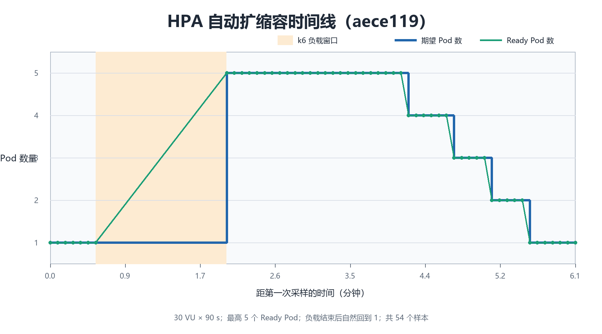
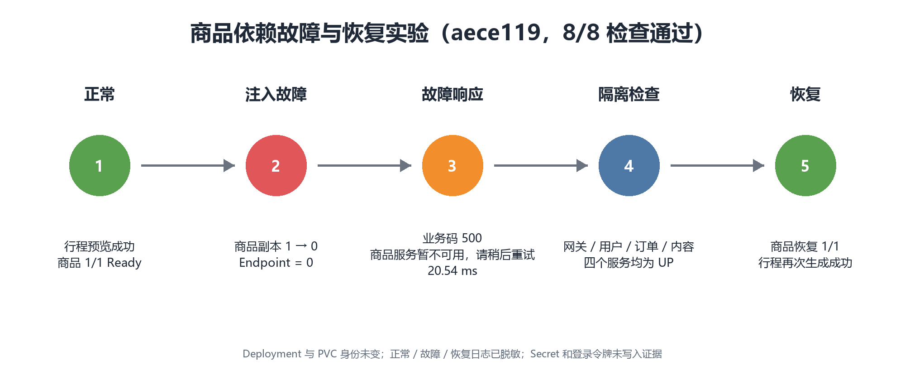
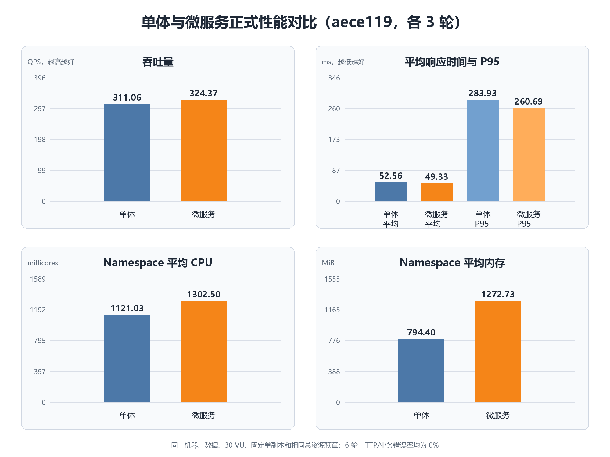

# 成员 E 第一、二阶段工作总结

代码分支：`codex/microservices-ci-integration`
实验版本：`aece11988e2364289625c0de2c75b18444c55b8d`
完成范围：成员 E 的 Kubernetes 部署、HPA、故障处理和性能对比任务（E1～E15）

## 一、完成的事务

1. 搭建本地 Kind Kubernetes 集群并安装 Metrics Server，可以采集节点和 Pod 的 CPU、内存数据。
2. 编写并完善单体和微服务版本的 Kubernetes 配置，包括 Namespace、Deployment、StatefulSet、Service、ConfigMap、Secret、PVC、健康探针和资源限制。
3. 将最新版单体系统和微服务系统分别部署到独立 Namespace，完成数据库初始化及运行状态检查。
4. 编写商品服务 HPA，配置 1～5 个副本和 60% CPU 目标，并完成自动扩缩容实验。
5. 编写 k6 压测、资源采集、故障注入和结果汇总脚本。
6. 完成商品服务依赖故障与恢复实验，保存正常、故障、恢复三个阶段的脱敏日志。
7. 在相同代码、数据、机器、并发、副本和总资源预算下，对单体和微服务各完成 3 轮性能测试。
8. 整理实验原始 JSON、CSV、日志、结果索引和三张结果图。

## 二、最终结果

### 1. 构建与部署

| 项目 | 结果 |
| --- | --- |
| 单体测试 | 139/139 通过 |
| 微服务 Java 测试 | 13/13 通过 |
| 前端测试 | 6 个测试文件、16/16 项通过，生产构建成功 |
| 单体 Kubernetes | 前端、后端、MySQL 全部 Ready |
| 微服务 Kubernetes | 前端、网关、4 个业务服务、MySQL 全部 Ready |
| Metrics Server | 能正常返回节点和 Pod 的 CPU、内存 |

### 2. HPA 自动扩缩容

- 30 个虚拟用户持续请求 90 秒，共完成 22,060 个请求，错误率为 0%。
- 商品服务在压力下由 1 个 Pod 自动扩到 5 个。
- 压力结束后自动按 `5 → 4 → 3 → 2 → 1` 缩容。
- 整个过程没有手动修改 Deployment 副本数或 CPU request。



### 3. 依赖故障与恢复

- 暂时将微服务版本的商品服务副本数从 1 调为 0。
- 行程接口返回事先设计的提示：“商品服务暂不可用，请稍后重试”。
- 网关、用户、订单、内容/行程服务保持健康。
- 商品服务恢复后，行程业务再次成功，Deployment 和 PVC 身份没有变化。
- 8/8 项故障检查全部通过。



### 4. 单体与微服务性能对比

测试条件：3 个主要只读接口、30 并发、每轮预热 30 秒并测量 60 秒、每种架构 3 轮、固定单副本、双方总资源预算相同。

| 三轮平均指标 | 单体 | 微服务 | 微服务相对单体 |
| --- | ---: | ---: | ---: |
| QPS | 311.06 | 324.37 | +4.28% |
| 平均响应时间 | 52.56 ms | 49.33 ms | -6.15% |
| P95 | 283.93 ms | 260.69 ms | -8.18% |
| HTTP/业务错误率 | 0% | 0% | 相同 |
| 平均 CPU | 1121.03m | 1302.50m | 微服务更高 |
| 平均内存 | 794.40Mi | 1272.73Mi | 微服务更高 |
| Running Pod | 3 | 7 | 微服务更多 |



## 三、结果分析

1. HPA 能根据 Metrics Server 的 CPU 指标自动调整商品服务 Pod 数量，说明扩缩容配置有效；负载停止后能够回到 1 个副本，避免持续占用额外资源。
2. 商品服务不可用时，故障没有导致整套微服务系统崩溃，其他服务仍然健康，恢复商品服务后业务恢复，说明故障能够被限制在依赖链路内。
3. 在本次本地只读接口测试中，微服务 QPS 比单体高约 4.28%，平均响应和 P95 略低，但微服务消耗了更多 CPU、内存，并运行更多 Pod。
4. 本结果只能说明当前代码、当前电脑和当前测试参数下的表现，不能直接得出“微服务在所有场景都比单体快”的结论。微服务的主要优势还包括独立部署、独立扩容和故障隔离，代价是更高的运行资源与管理复杂度。

## 四、证据位置

- 可提交结果索引：`experiments/results/latest-evidence-index.json`
<<<<<<< HEAD
- 原始实验目录：`artifacts/member-e/aece119/`，已被 Git 忽略。
- 原始数据单独交付：`成员E-最新版原始证据-aece119-20260831.zip`
=======
- 原始实验目录：`artifacts/member-e/aece119/`，日常运行目录仍被 Git 忽略。
- 已入库原始证据：`experiments/results/成员E-最新版原始证据-aece119-20260831.zip`
- 证据包大小：34,677,553 字节；包含 79 个条目。
- SHA-256：`279A7B1C9FA94820D9BD86A93D3C2CE788D1ED4737006ACE868CC36566EF4D41`

证据包包含单体和微服务构建记录、对比部署协议、HPA 原始 k6 结果与时间线、故障前/中/后日志、六轮正式性能 summary 和资源采样 CSV。复核方法见 `experiments/results/成员E-原始证据说明.md`。

## 五、最短复现入口

在仓库根目录、Docker Desktop 和 `kind-travel-platform` 集群正常时执行。

HPA 实验：

```powershell
kubectl --context kind-travel-platform apply -f deploy/member-e-benchmark/hpa.yaml
pwsh -NoProfile -File scripts/run-member-e-hpa.ps1
kubectl --context kind-travel-platform delete -f deploy/member-e-benchmark/hpa.yaml
```

商品依赖故障实验（必须先确认 HPA 已删除）：

```powershell
pwsh -NoProfile -File experiments/scripts/run-product-dependency-fault.ps1 -AllowDisruption
```

单体与微服务正式对比实验已有完整原始结果；重新运行前必须确认同一源码、同一数据、同一资源预算并由小组确认正式基线：

```powershell
pwsh -NoProfile -File scripts/run-member-e-formal-comparison.ps1 -TeamBaselineConfirmed
```

## 六、AI 工具使用与人工检查

本工作使用 Codex 辅助检查 Kubernetes 配置、编写实验与证据处理脚本、排查 Docker/Kind 问题和整理说明。成员 E 通过真实集群状态、API 响应、测试退出码、原始 JSON/CSV、Kubernetes 事件及 SHA-256 校验人工复核结果；AI 输出未直接作为实验结论。仓库和证据包不保存真实密码、Token 或第三方 API Key。
>>>>>>> github/codex/microservices-ci-integration
