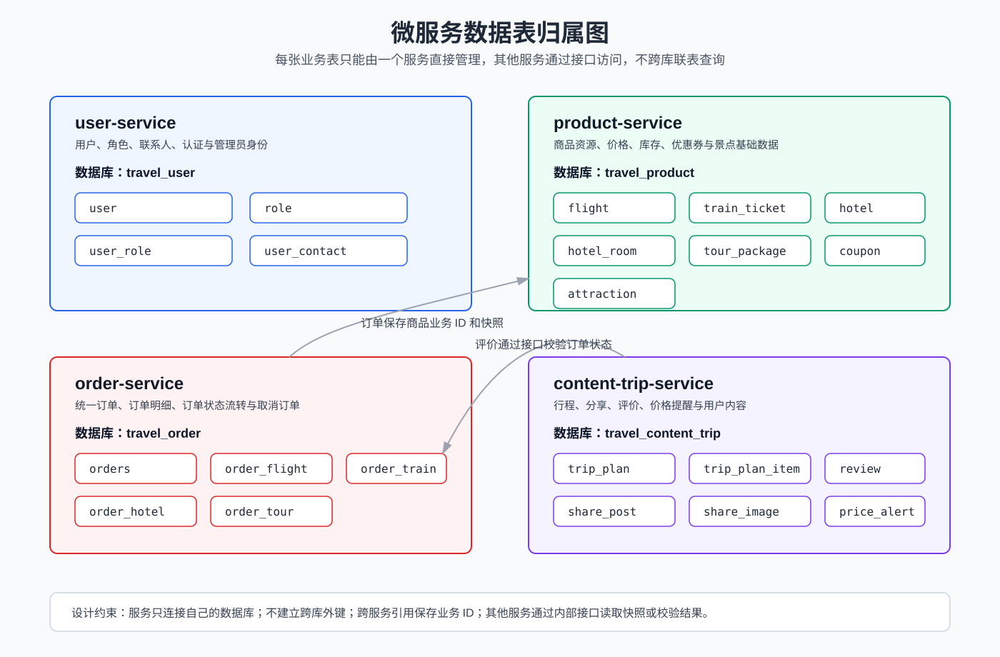

# 数据表归属表

## 1. 说明

微服务拆分后，每张业务表只能归属到一个服务，由该服务直接访问和维护。其他服务如需使用相关数据，只能通过归属服务提供的接口获取，不允许跨服务直接查表或跨库联表查询。

本项目建议使用同一个 MySQL 实例，按服务拆分为 4 个数据库：

| 数据库 | 归属服务 | 说明 |
| --- | --- | --- |
| `travel_user` | `user-service` | 用户、角色、联系人、认证身份 |
| `travel_product` | `product-service` | 商品、库存、优惠券、景点 |
| `travel_order` | `order-service` | 订单主表、订单明细、订单状态 |
| `travel_content_trip` | `content-trip-service` | 行程、分享、评价、价格提醒 |

## 2. 数据表归属图

## 3. 数据表归属明细

| 表名 | 归属服务 | 所属数据库 | 表用途 | 是否被其他服务引用 | 其他服务访问方式 |
| --- | --- | --- | --- | --- | --- |
| `user` | `user-service` | `travel_user` | 保存用户账号、密码、昵称、手机号、状态等基础信息 | 是 | 其他服务通过 JWT 中的 `userId` 识别当前用户，必要时调用用户服务接口 |
| `role` | `user-service` | `travel_user` | 保存普通用户、管理员等角色信息 | 是 | 后台权限通过 JWT 角色信息校验 |
| `user_role` | `user-service` | `travel_user` | 保存用户和角色的关联关系 | 是 | 由 `user-service` 登录时写入 token 或提供角色查询 |
| `user_contact` | `user-service` | `travel_user` | 保存用户常用出行人和联系人信息 | 否 | 仅 `user-service` 内部访问 |
| `flight` | `product-service` | `travel_product` | 保存航班基础信息、价格、库存和状态 | 是 | `order-service` 通过商品快照和库存接口访问 |
| `train_ticket` | `product-service` | `travel_product` | 保存车次、席别价格、席别库存和状态 | 是 | `order-service` 通过商品快照和库存接口访问 |
| `hotel` | `product-service` | `travel_product` | 保存酒店基础信息、城市、地址、图片和状态 | 是 | `order-service` 通过商品快照接口访问酒店信息 |
| `hotel_room` | `product-service` | `travel_product` | 保存房型、价格、库存、早餐、入住人数等信息 | 是 | `order-service` 通过商品快照和库存接口访问 |
| `tour_package` | `product-service` | `travel_product` | 保存旅游产品、目的地、天数、价格、库存和状态 | 是 | `order-service` 通过商品快照和库存接口访问 |
| `attraction` | `product-service` | `travel_product` | 保存行程生成使用的本地景点候选数据 | 是 | `content-trip-service` 通过景点候选接口访问 |
| `coupon` | `product-service` | `travel_product` | 保存优惠券、满减门槛、适用商品类型和状态 | 是 | 价格对比由 `product-service` 内部处理，其他服务不直接访问 |
| `orders` | `order-service` | `travel_order` | 保存订单号、用户 ID、业务类型、总金额、订单状态等公共字段 | 是 | `content-trip-service` 通过订单校验接口判断是否可评价 |
| `order_flight` | `order-service` | `travel_order` | 保存机票订单明细和航班快照 | 否 | 仅 `order-service` 内部访问 |
| `order_train` | `order-service` | `travel_order` | 保存火车票订单明细和车次快照 | 否 | 仅 `order-service` 内部访问 |
| `order_hotel` | `order-service` | `travel_order` | 保存酒店订单明细、房型快照和入住信息 | 否 | 仅 `order-service` 内部访问 |
| `order_tour` | `order-service` | `travel_order` | 保存旅游产品订单明细和产品快照 | 否 | 仅 `order-service` 内部访问 |
| `trip_plan` | `content-trip-service` | `travel_content_trip` | 保存用户行程计划主信息 | 否 | 仅 `content-trip-service` 内部访问 |
| `trip_plan_item` | `content-trip-service` | `travel_content_trip` | 保存行程计划中的每日安排 | 否 | 仅 `content-trip-service` 内部访问 |
| `share_post` | `content-trip-service` | `travel_content_trip` | 保存旅行分享标题、正文、作者、浏览量和状态 | 否 | 仅 `content-trip-service` 内部访问 |
| `share_image` | `content-trip-service` | `travel_content_trip` | 保存旅行分享图片地址和排序 | 否 | 仅 `content-trip-service` 内部访问 |
| `review` | `content-trip-service` | `travel_content_trip` | 保存订单评价、评分、评价内容和用户 ID | 是 | 创建前调用 `order-service` 校验订单状态 |
| `price_alert` | `content-trip-service` | `travel_content_trip` | 保存用户价格提醒目标、商品类型、商品 ID 和目标价格 | 是 | 创建和展示时调用 `product-service` 查询商品当前价格 |

## 4. 跨服务引用关系

| 引用方 | 被引用数据 | 数据归属服务 | 访问方式 | 说明 |
| --- | --- | --- | --- | --- |
| `order-service` | 商品价格、库存、状态 | `product-service` | 商品快照接口、扣库存接口、恢复库存接口 | 下单和取消订单时使用 |
| `content-trip-service` | 订单状态、订单归属 | `order-service` | 订单评价校验接口 | 提交评价前使用 |
| `content-trip-service` | 景点候选数据 | `product-service` | 景点候选接口 | AI 或本地规则行程生成时使用 |
| `content-trip-service` | 商品当前价格 | `product-service` | 商品快照或价格查询接口 | 价格提醒创建和展示时使用 |
| `product-service` | 管理员身份 | `user-service` | JWT 角色信息 | 后台商品管理接口使用 |
| `order-service` | 当前用户身份 | `user-service` | JWT 用户 ID | 查询、创建、取消订单时使用 |

## 5. 数据库拆分建议

### 5.1 user-service 数据库

数据库名：`travel_user`

包含表：

| 表名 | 说明 |
| --- | --- |
| `user` | 用户账号和基础资料 |
| `role` | 角色信息 |
| `user_role` | 用户角色关系 |
| `user_contact` | 常用联系人 |

### 5.2 product-service 数据库

数据库名：`travel_product`

包含表：

| 表名 | 说明 |
| --- | --- |
| `flight` | 航班商品 |
| `train_ticket` | 火车票商品 |
| `hotel` | 酒店 |
| `hotel_room` | 酒店房型 |
| `tour_package` | 旅游产品 |
| `attraction` | 景点基础数据 |
| `coupon` | 优惠券 |

### 5.3 order-service 数据库

数据库名：`travel_order`

包含表：

| 表名 | 说明 |
| --- | --- |
| `orders` | 订单主表 |
| `order_flight` | 机票订单明细 |
| `order_train` | 火车票订单明细 |
| `order_hotel` | 酒店订单明细 |
| `order_tour` | 旅游产品订单明细 |

### 5.4 content-trip-service 数据库

数据库名：`travel_content_trip`

包含表：

| 表名 | 说明 |
| --- | --- |
| `trip_plan` | 行程计划 |
| `trip_plan_item` | 行程每日安排 |
| `share_post` | 旅行分享 |
| `share_image` | 分享图片 |
| `review` | 订单评价 |
| `price_alert` | 价格提醒 |

## 6. 设计约束

1. 每个服务只连接自己的数据库。
2. 不建立跨数据库外键。
3. 不跨服务直接联表查询。
4. 跨服务引用统一保存业务 ID。
5. 订单明细中保存商品快照，避免商品信息修改后影响历史订单展示。
6. 其他服务需要商品、订单或用户信息时，必须通过对应服务提供的接口访问。

## 7. 对后续代码拆分的指导

数据表归属确定后，代码拆分可以按照 Entity 和 Mapper 归属推进：

| 服务 | 需要迁移的 Entity 和 Mapper |
| --- | --- |
| `user-service` | `User`、`Role`、`UserRole`、`UserContact` 及对应 Mapper |
| `product-service` | `Flight`、`TrainTicket`、`Hotel`、`HotelRoom`、`TourPackage`、`Attraction`、`Coupon` 及对应 Mapper |
| `order-service` | `Orders`、`OrderFlight`、`OrderTrain`、`OrderHotel`、`OrderTour` 及对应 Mapper |
| `content-trip-service` | `TripPlan`、`TripPlanItem`、`SharePost`、`ShareImage`、`Review`、`PriceAlert` 及对应 Mapper |

拆分过程中，如果某个 Service 需要访问不属于自己的 Mapper，应改造为跨服务客户端调用。
