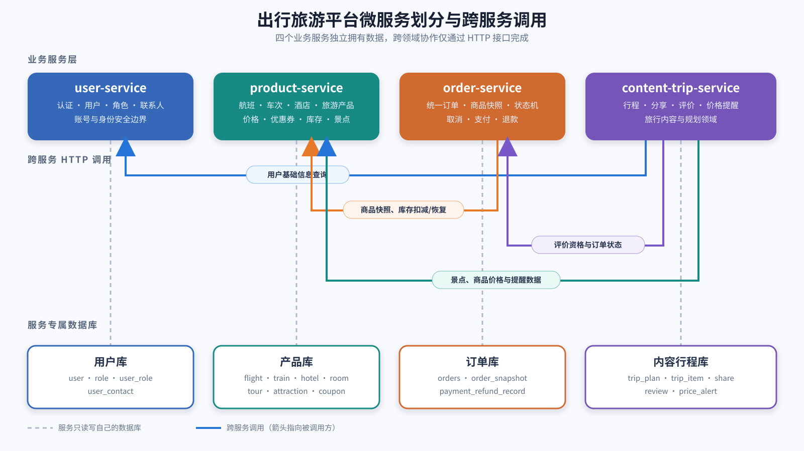

# 服务划分图

## 1. 图示说明

本项目微服务拆分采用 4 个业务服务：

| 服务 | 核心职责 | 数据归属 |
| --- | --- | --- |
| `user-service` | 用户、角色、联系人、登录认证、管理员身份 | 用户库 |
| `product-service` | 航班、车次、酒店、房型、旅游产品、景点、优惠券、库存 | 产品库 |
| `order-service` | 统一订单、商品快照、订单状态、取消与退款 | 订单库 |
| `content-trip-service` | 行程、分享、评价、价格提醒 | 内容行程库 |

拆分后，各服务只访问自己的数据库，不跨服务直接查表。订单创建、订单取消、评价校验、行程生成和价格提醒等跨领域业务通过 HTTP 接口完成。

### 拆分依据

- `user-service` 围绕账号、身份和联系人形成独立安全边界，其他服务只消费 JWT 或用户基础信息接口。
- `product-service` 统一拥有可售商品、价格、优惠券和库存，避免多个服务同时修改库存。
- `order-service` 负责交易状态机，并在一张统一订单表中保存商品快照；历史订单不依赖商品表当前值。
- `content-trip-service` 合并行程、分享、评价和价格提醒。这些功能数据量较小、均属于用户旅行内容域，课程项目中合并可减少部署复杂度，同时仍与用户、商品、订单数据严格隔离。

API 网关、注册中心、配置中心、前端和数据库属于基础设施，不计入业务微服务数量。

## 2. 微服务总体划分图

新版总体图采用固定双排布局：四个业务服务位于顶部，四个专属数据库位于底部。灰色虚线表示服务的数据所有权，彩色有向线表示跨服务 HTTP 调用，箭头指向被调用服务。

## 3. 服务职责关系图

## 4. 数据表归属图

## 5. 关键跨服务调用图

