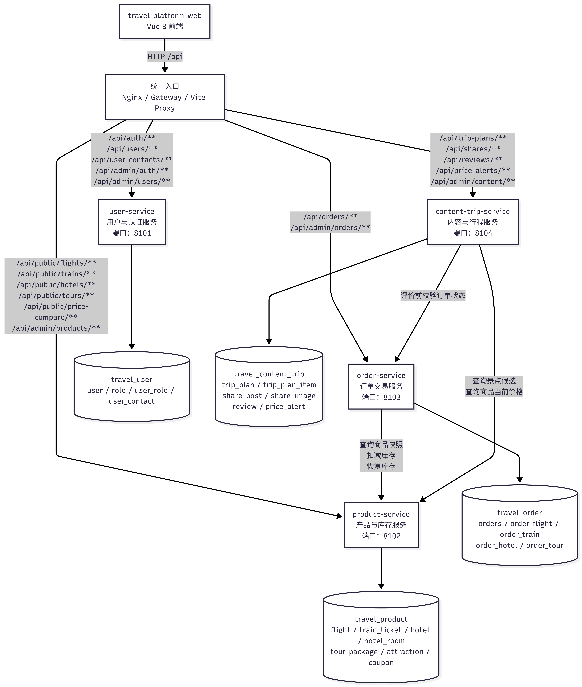
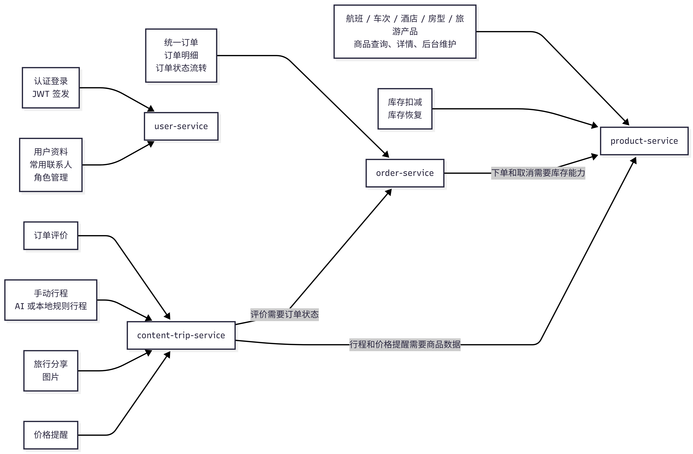
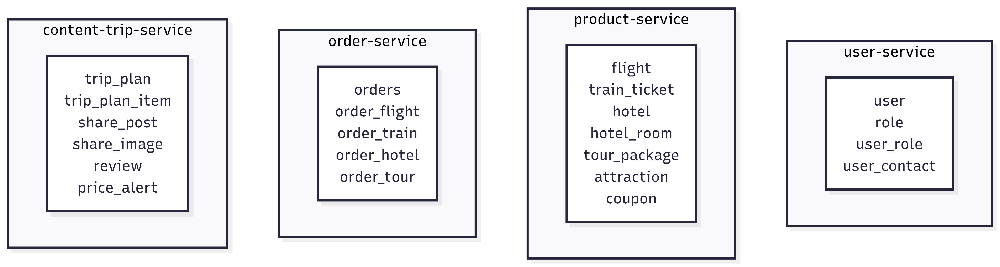
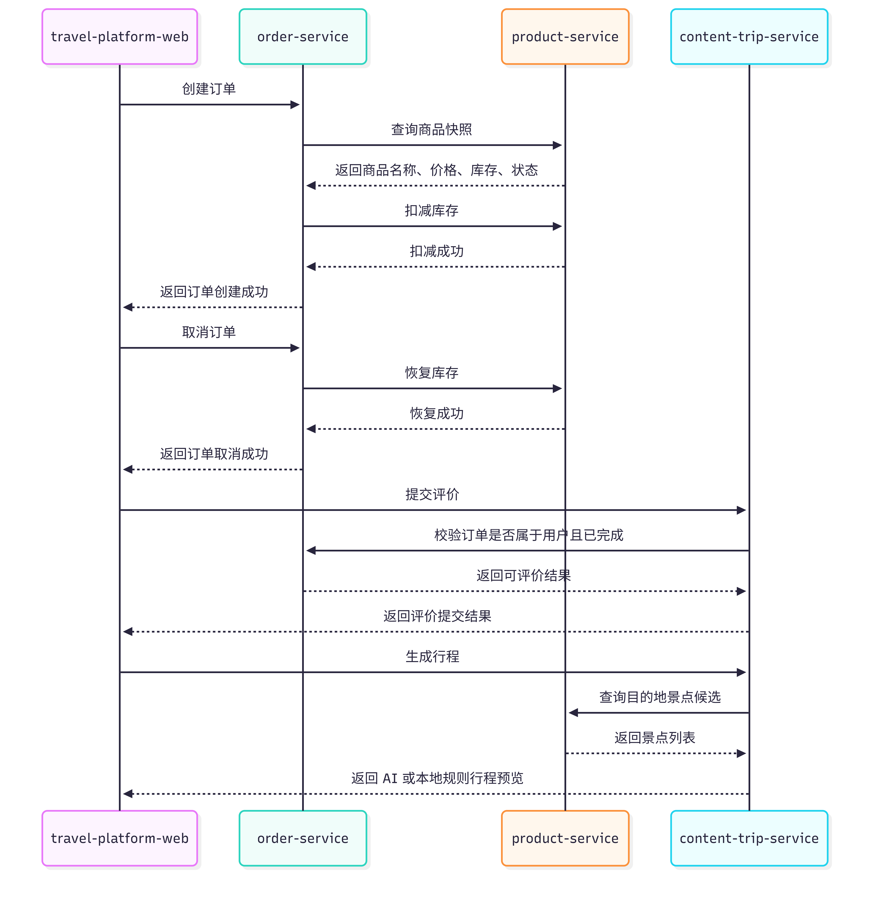

# 服务划分图

## 1. 图示说明

本项目微服务拆分采用 4 个业务服务：

| 服务 | 核心职责 | 数据归属 |
| --- | --- | --- |
| `user-service` | 用户、角色、联系人、登录认证、管理员身份 | 用户库 |
| `product-service` | 航班、车次、酒店、房型、旅游产品、景点、优惠券、库存 | 产品库 |
| `order-service` | 订单主表、订单明细、订单状态、取消订单 | 订单库 |
| `content-trip-service` | 行程、分享、评价、价格提醒 | 内容行程库 |

拆分后，各服务只访问自己的数据库，不跨服务直接查表。订单创建、订单取消、评价校验、行程生成和价格提醒等跨领域业务通过 HTTP 接口完成。

## 2. 微服务总体划分图

## 3. 服务职责关系图

## 4. 数据表归属图

## 5. 关键跨服务调用图

