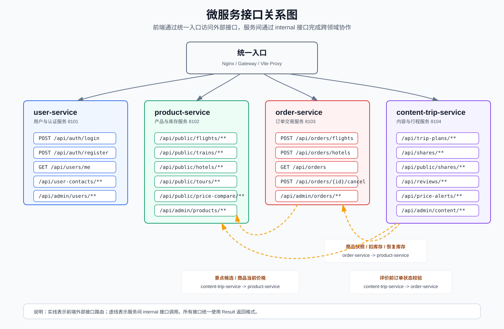

# 服务接口清单

## 1. 说明

本文档用于说明微服务拆分后各服务对外提供的接口、服务间内部接口和统一入口转发规则。

接口分为两类：

| 类型 | 说明 |
| --- | --- |
| 外部接口 | 前端或管理员页面直接访问的 `/api/**` 接口 |
| 内部接口 | 微服务之间调用的 `/internal/**` 接口，不直接暴露给前端 |

## 2. 接口关系图

## 3. user-service 接口

服务职责：用户注册登录、JWT 签发、用户资料、常用联系人、管理员认证和后台用户管理。

建议端口：`8101`

### 3.1 前台认证接口

| 方法 | 路径 | 功能 | 是否需要登录 | 说明 |
| --- | --- | --- | --- | --- |
| `POST` | `/api/auth/register` | 用户注册 | 否 | 创建普通用户账号 |
| `POST` | `/api/auth/login` | 用户登录 | 否 | 登录成功后返回 JWT |
| `POST` | `/api/auth/logout` | 用户退出 | 是 | 将当前 token 退出或加入黑名单 |

### 3.2 当前用户接口

| 方法 | 路径 | 功能 | 是否需要登录 | 说明 |
| --- | --- | --- | --- | --- |
| `GET` | `/api/users/me` | 查询当前用户信息 | 是 | 根据 JWT 中的用户 ID 查询 |
| `PUT` | `/api/users/me` | 修改当前用户信息 | 是 | 修改昵称、手机号等资料 |

### 3.3 常用联系人接口

| 方法 | 路径 | 功能 | 是否需要登录 | 说明 |
| --- | --- | --- | --- | --- |
| `GET` | `/api/user-contacts` | 查询当前用户联系人列表 | 是 | 只返回当前用户的数据 |
| `POST` | `/api/user-contacts` | 新增联系人 | 是 | 新增出行人或联系人 |
| `PUT` | `/api/user-contacts/{id}` | 修改联系人 | 是 | 修改前校验归属 |
| `DELETE` | `/api/user-contacts/{id}` | 删除联系人 | 是 | 删除前校验归属 |

### 3.4 后台用户接口

| 方法 | 路径 | 功能 | 是否需要管理员 | 说明 |
| --- | --- | --- | --- | --- |
| `POST` | `/api/admin/auth/login` | 管理员登录 | 否 | 登录成功后返回管理员 JWT |
| `GET` | `/api/admin/auth/me` | 查询当前管理员信息 | 是 | 校验管理员角色 |
| `GET` | `/api/admin/users` | 后台用户列表 | 是 | 支持按用户名、状态等筛选 |
| `GET` | `/api/admin/users/{id}` | 用户详情 | 是 | 查询用户基础信息和角色 |
| `PUT` | `/api/admin/users/{id}/status` | 修改用户状态 | 是 | 启用或禁用账号 |
| `PUT` | `/api/admin/users/{id}/roles` | 修改用户角色 | 是 | 维护普通用户或管理员角色 |
| `GET` | `/api/admin/roles` | 查询角色选项 | 是 | 用于后台用户角色选择 |

## 4. product-service 接口

服务职责：航班、车次、酒店、房型、旅游产品、景点、优惠券、商品库存和价格对比。

建议端口：`8102`

### 4.1 前台商品查询接口

| 方法 | 路径 | 功能 | 是否需要登录 | 说明 |
| --- | --- | --- | --- | --- |
| `GET` | `/api/public/flights` | 航班查询 | 否 | 支持出发地、目的地、日期等条件 |
| `GET` | `/api/public/flights/{id}` | 航班详情 | 否 | 查询单个航班 |
| `GET` | `/api/public/trains` | 火车票查询 | 否 | 支持出发地、目的地、日期等条件 |
| `GET` | `/api/public/trains/{id}` | 车次详情 | 否 | 返回席别价格和库存 |
| `GET` | `/api/public/hotels` | 酒店查询 | 否 | 支持城市、区域等条件 |
| `GET` | `/api/public/hotels/{id}` | 酒店详情 | 否 | 返回酒店和房型列表 |
| `GET` | `/api/public/tours` | 旅游产品查询 | 否 | 支持目的地分页查询 |
| `GET` | `/api/public/tours/{id}` | 旅游产品详情 | 否 | 返回旅游产品详情 |

### 4.2 价格对比接口

| 方法 | 路径 | 功能 | 是否需要登录 | 说明 |
| --- | --- | --- | --- | --- |
| `GET` | `/api/public/price-compare/flights/{id}` | 航班价格对比 | 否 | 对比同线路航班价格和优惠 |
| `GET` | `/api/public/price-compare/hotels/{id}` | 酒店价格对比 | 否 | 对比同城市酒店或房型价格 |
| `GET` | `/api/public/price-compare/tours/{id}` | 旅游产品价格对比 | 否 | 对比同目的地旅游产品 |

### 4.3 后台商品管理接口

| 方法 | 路径 | 功能 | 是否需要管理员 | 说明 |
| --- | --- | --- | --- | --- |
| `GET` | `/api/admin/flights` | 后台航班列表 | 是 | 查询航班管理列表 |
| `POST` | `/api/admin/flights` | 新增航班 | 是 | 新增航班商品 |
| `PUT` | `/api/admin/flights/{id}` | 修改航班 | 是 | 修改航班信息 |
| `DELETE` | `/api/admin/flights/{id}` | 删除航班 | 是 | 有关联订单时应拒绝或提示 |
| `GET` | `/api/admin/trains` | 后台车次列表 | 是 | 查询车次管理列表 |
| `POST` | `/api/admin/trains` | 新增车次 | 是 | 新增火车票商品 |
| `PUT` | `/api/admin/trains/{id}` | 修改车次 | 是 | 修改车次和席别库存 |
| `DELETE` | `/api/admin/trains/{id}` | 删除车次 | 是 | 有关联订单时应拒绝或提示 |
| `GET` | `/api/admin/hotels` | 后台酒店列表 | 是 | 查询酒店列表 |
| `POST` | `/api/admin/hotels` | 新增酒店 | 是 | 新增酒店 |
| `PUT` | `/api/admin/hotels/{id}` | 修改酒店 | 是 | 修改酒店基础信息 |
| `DELETE` | `/api/admin/hotels/{id}` | 删除酒店 | 是 | 有房型时应先处理房型 |
| `GET` | `/api/admin/hotel-rooms` | 后台房型列表 | 是 | 查询房型列表 |
| `POST` | `/api/admin/hotel-rooms` | 新增房型 | 是 | 新增酒店房型 |
| `PUT` | `/api/admin/hotel-rooms/{id}` | 修改房型 | 是 | 修改价格和库存 |
| `DELETE` | `/api/admin/hotel-rooms/{id}` | 删除房型 | 是 | 有关联订单时应拒绝或提示 |
| `GET` | `/api/admin/tours` | 后台旅游产品列表 | 是 | 查询旅游产品 |
| `POST` | `/api/admin/tours` | 新增旅游产品 | 是 | 新增旅游产品 |
| `PUT` | `/api/admin/tours/{id}` | 修改旅游产品 | 是 | 修改产品信息 |
| `DELETE` | `/api/admin/tours/{id}` | 删除旅游产品 | 是 | 有关联订单时应拒绝或提示 |
| `POST` | `/api/admin/media/upload` | 商品图片上传 | 是 | 上传商品封面图或详情图 |

### 4.4 内部商品接口

| 方法 | 路径 | 调用方 | 功能 | 说明 |
| --- | --- | --- | --- | --- |
| `GET` | `/internal/products/{type}/{id}/snapshot` | `order-service`、`content-trip-service` | 查询商品快照 | 返回商品名称、价格、库存、状态等 |
| `POST` | `/internal/products/stock/deduct` | `order-service` | 扣减库存 | 下单时调用 |
| `POST` | `/internal/products/stock/restore` | `order-service` | 恢复库存 | 取消订单或补偿时调用 |
| `GET` | `/api/internal/coupons/settlement` | `order-service` | 优惠券结算 | 可选优惠券校验，返回原价、优惠金额和应付金额 |
| `GET` | `/internal/attractions` | `content-trip-service` | 查询景点候选 | 根据城市、偏好查询行程候选景点 |

## 5. order-service 接口

服务职责：统一订单创建、订单查询、订单详情、订单取消、订单状态流转和后台订单管理。

建议端口：`8103`

### 5.1 前台订单接口

| 方法 | 路径 | 功能 | 是否需要登录 | 说明 |
| --- | --- | --- | --- | --- |
| `POST` | `/api/orders/flights` | 创建机票订单 | 是 | 调用产品服务查询航班并扣库存 |
| `POST` | `/api/orders/trains` | 创建火车票订单 | 是 | 调用产品服务查询车次并扣席别库存 |
| `POST` | `/api/orders/hotels` | 创建酒店订单 | 是 | 调用产品服务查询房型并扣库存 |
| `POST` | `/api/orders/tours` | 创建旅游产品订单 | 是 | 调用产品服务查询产品并扣库存 |
| `GET` | `/api/orders` | 查询当前用户订单列表 | 是 | 支持业务类型和状态筛选 |
| `GET` | `/api/orders/{id}` | 查询订单详情 | 是 | 校验订单归属 |
| `POST` | `/api/orders/{id}/cancel` | 取消订单 | 是 | 取消成功后调用产品服务恢复库存 |
| `GET` | `/api/orders/reviewable` | 查询可评价订单 | 是 | 可保留在订单服务，也可由内容服务聚合 |

### 5.2 后台订单接口

| 方法 | 路径 | 功能 | 是否需要管理员 | 说明 |
| --- | --- | --- | --- | --- |
| `GET` | `/api/admin/orders` | 后台订单列表 | 是 | 支持状态、类型、用户等条件 |
| `GET` | `/api/admin/orders/{id}` | 后台订单详情 | 是 | 查询订单和明细 |
| `PUT` | `/api/admin/orders/{id}/status` | 修改订单状态 | 是 | 模拟支付、待出行、已完成等状态流转 |
| `POST` | `/api/admin/orders/{id}/cancel` | 后台取消订单 | 是 | 管理员取消订单并恢复库存 |

### 5.3 内部订单接口

| 方法 | 路径 | 调用方 | 功能 | 说明 |
| --- | --- | --- | --- | --- |
| `GET` | `/internal/orders/{id}/review-check` | `content-trip-service` | 评价前订单校验 | 校验订单是否存在、是否属于用户、是否已完成、是否已评价 |
| `POST` | `/internal/orders/{id}/reviewed` | `content-trip-service` | 标记订单已评价 | 可选，用于避免重复评价或辅助订单展示 |

## 6. content-trip-service 接口

服务职责：行程规划、AI 或本地规则行程生成、旅行分享、订单评价、价格提醒和后台内容管理。

建议端口：`8104`

### 6.1 行程接口

| 方法 | 路径 | 功能 | 是否需要登录 | 说明 |
| --- | --- | --- | --- | --- |
| `GET` | `/api/trip-plans` | 查询当前用户行程列表 | 是 | 只返回当前用户行程 |
| `POST` | `/api/trip-plans` | 创建行程计划 | 是 | 手动创建行程 |
| `GET` | `/api/trip-plans/{id}` | 查询行程详情 | 是 | 校验行程归属 |
| `PUT` | `/api/trip-plans/{id}` | 修改行程计划 | 是 | 修改标题、目的地、日期等 |
| `DELETE` | `/api/trip-plans/{id}` | 删除行程计划 | 是 | 删除行程及行程项 |
| `POST` | `/api/trip-plans/{id}/items` | 新增行程项 | 是 | 新增每日安排 |
| `PUT` | `/api/trip-plans/{planId}/items/{itemId}` | 修改行程项 | 是 | 修改每日安排 |
| `DELETE` | `/api/trip-plans/{planId}/items/{itemId}` | 删除行程项 | 是 | 删除每日安排 |
| `POST` | `/api/trip-plans/ai-preview` | 生成行程预览 | 是 | 调用产品服务获取景点候选，AI 失败时本地规则回退 |
| `POST` | `/api/trip-plans/ai-save` | 保存生成行程 | 是 | 将预览结果保存为正式行程 |

### 6.2 分享接口

| 方法 | 路径 | 功能 | 是否需要登录 | 说明 |
| --- | --- | --- | --- | --- |
| `GET` | `/api/public/shares` | 公开分享列表 | 否 | 游客和登录用户均可浏览 |
| `GET` | `/api/public/shares/{id}` | 公开分享详情 | 否 | 增加浏览量并展示图片 |
| `GET` | `/api/shares` | 当前用户分享列表 | 是 | 查询自己发布的分享 |
| `POST` | `/api/shares` | 发布分享 | 是 | 保存标题、正文和图片 |
| `POST` | `/api/shares/upload` | 上传分享图片 | 是 | 上传分享图片 |
| `DELETE` | `/api/shares/{id}` | 删除自己的分享 | 是 | 删除前校验归属 |

### 6.3 评价接口

| 方法 | 路径 | 功能 | 是否需要登录 | 说明 |
| --- | --- | --- | --- | --- |
| `POST` | `/api/reviews` | 提交订单评价 | 是 | 调用订单服务校验订单状态 |
| `GET` | `/api/reviews/orders/{orderId}` | 查询订单评价 | 是 | 查询某订单评价详情 |

### 6.4 价格提醒接口

| 方法 | 路径 | 功能 | 是否需要登录 | 说明 |
| --- | --- | --- | --- | --- |
| `GET` | `/api/price-alerts` | 查询当前用户价格提醒 | 是 | 查询提醒列表，并可调用产品服务刷新当前价格 |
| `POST` | `/api/price-alerts` | 创建价格提醒 | 是 | 创建前调用产品服务确认商品存在和当前价格 |
| `DELETE` | `/api/price-alerts/{id}` | 删除价格提醒 | 是 | 删除前校验归属 |

### 6.5 后台内容接口

| 方法 | 路径 | 功能 | 是否需要管理员 | 说明 |
| --- | --- | --- | --- | --- |
| `GET` | `/api/admin/shares` | 后台分享列表 | 是 | 查询所有分享 |
| `DELETE` | `/api/admin/shares/{id}` | 删除违规分享 | 是 | 后台内容管理 |
| `GET` | `/api/admin/reviews` | 后台评价列表 | 是 | 查询所有评价 |
| `DELETE` | `/api/admin/reviews/{id}` | 删除违规评价 | 是 | 后台内容管理 |

## 7. 健康检查与版本接口

每个微服务统一提供以下接口，方便本地联调、Docker Compose、CI/CD 和 Kubernetes 探针使用。

| 方法 | 路径 | 功能 | 说明 |
| --- | --- | --- | --- |
| `GET` | `/api/public/health` | 健康检查 | 返回服务名、状态和当前时间 |
| `GET` | `/api/public/version` | 版本信息 | 返回服务名、版本号和启动时间 |

## 8. 路由转发规则

| 路径 | 目标服务 | 说明 |
| --- | --- | --- |
| `/api/auth/**` | `user-service` | 用户注册、登录、退出 |
| `/api/users/**` | `user-service` | 当前用户资料 |
| `/api/user-contacts/**` | `user-service` | 常用联系人 |
| `/api/admin/auth/**` | `user-service` | 管理员认证 |
| `/api/admin/users/**` | `user-service` | 后台用户管理 |
| `/api/admin/roles/**` | `user-service` | 后台角色选项 |
| `/api/public/flights/**` | `product-service` | 航班查询 |
| `/api/public/trains/**` | `product-service` | 车次查询 |
| `/api/public/hotels/**` | `product-service` | 酒店查询 |
| `/api/public/tours/**` | `product-service` | 旅游产品查询 |
| `/api/public/price-compare/**` | `product-service` | 价格对比 |
| `/api/admin/flights/**` | `product-service` | 后台航班管理 |
| `/api/admin/trains/**` | `product-service` | 后台车次管理 |
| `/api/admin/hotels/**` | `product-service` | 后台酒店管理 |
| `/api/admin/hotel-rooms/**` | `product-service` | 后台房型管理 |
| `/api/admin/tours/**` | `product-service` | 后台旅游产品管理 |
| `/api/admin/media/**` | `product-service` | 商品图片上传 |
| `/api/orders/**` | `order-service` | 订单创建、查询、取消 |
| `/api/admin/orders/**` | `order-service` | 后台订单管理 |
| `/api/trip-plans/**` | `content-trip-service` | 行程规划 |
| `/api/shares/**` | `content-trip-service` | 用户分享 |
| `/api/public/shares/**` | `content-trip-service` | 公开分享 |
| `/api/reviews/**` | `content-trip-service` | 订单评价 |
| `/api/price-alerts/**` | `content-trip-service` | 价格提醒 |
| `/api/admin/shares/**` | `content-trip-service` | 后台分享管理 |
| `/api/admin/reviews/**` | `content-trip-service` | 后台评价管理 |

## 9. 内部接口调用清单

| 调用方 | 被调用方 | 接口 | 场景 | 失败处理 |
| --- | --- | --- | --- | --- |
| `order-service` | `product-service` | `GET /internal/products/{type}/{id}/snapshot` | 下单前查询商品价格、库存、状态 | 商品服务不可用时下单失败 |
| `order-service` | `product-service` | `POST /internal/products/stock/deduct` | 下单时扣减库存 | 库存不足或扣减失败时不创建订单 |
| `order-service` | `product-service` | `POST /internal/products/stock/restore` | 取消订单或订单写入失败补偿 | 恢复失败时记录日志并返回明确提示 |
| `content-trip-service` | `order-service` | `GET /internal/orders/{id}/review-check` | 提交评价前校验订单 | 订单服务不可用时拒绝评价 |
| `content-trip-service` | `order-service` | `POST /internal/orders/{id}/reviewed` | 评价成功后标记订单 | 可选接口，失败时记录日志 |
| `content-trip-service` | `product-service` | `GET /internal/attractions` | 行程生成时查询景点候选 | 失败时使用本地规则或固定演示数据 |
| `content-trip-service` | `product-service` | `GET /internal/products/{type}/{id}/snapshot` | 价格提醒查询商品当前价格 | 展示时失败则显示当前价格暂不可用 |

## 10. 接口设计约束

1. 所有外部接口继续使用 `/api` 前缀，降低前端改造成本。
2. 服务间接口统一使用 `/internal` 前缀，不直接暴露给前端。
3. 所有接口使用统一 `Result` 返回格式。
4. 需要登录的接口从 JWT 中解析当前用户 ID。
5. 后台接口必须校验管理员角色。
6. 服务间调用必须设置超时时间，建议 2-3 秒。
7. 服务间调用失败时返回明确业务提示，并记录调用日志。
