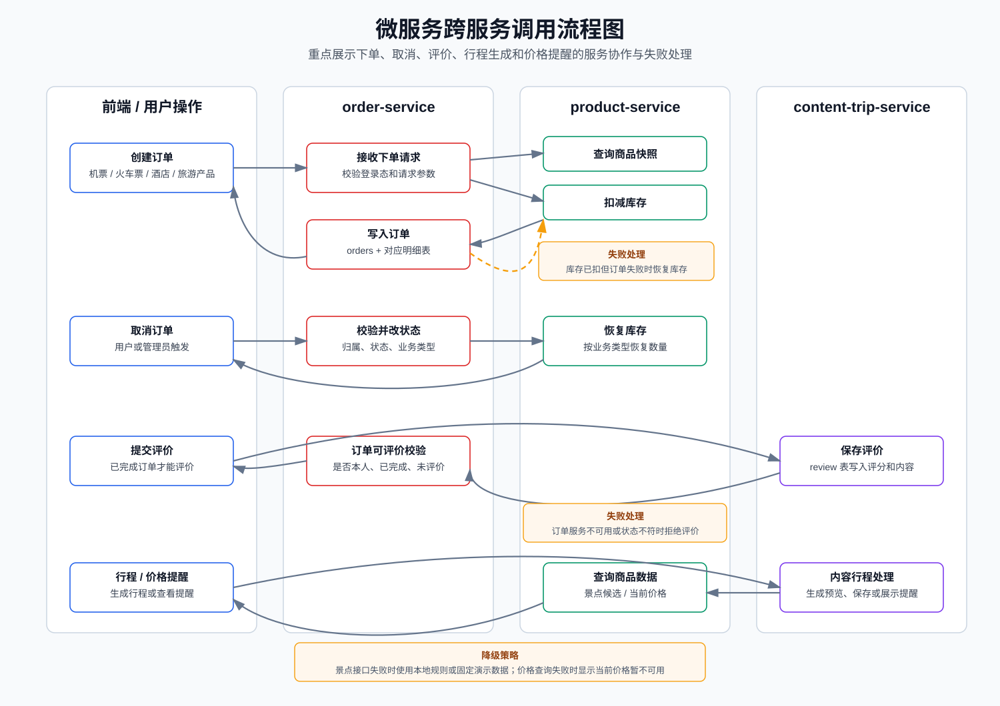

# 跨服务调用说明

## 1. 说明

微服务拆分后，各服务只能直接访问自己的数据库。涉及多个业务领域的流程，需要通过服务间接口完成协作。本项目的核心跨服务调用集中在订单、库存、评价、行程生成和价格提醒几个场景。

服务间接口统一使用 `/internal/**` 前缀，主要供服务内部调用，不直接暴露给前端页面。

## 2. 跨服务调用流程图

## 3. 跨服务调用总览

| 调用方 | 被调用方 | 业务场景 | 调用目的 |
| --- | --- | --- | --- |
| `order-service` | `product-service` | 创建订单 | 查询商品快照、校验价格库存、扣减库存 |
| `order-service` | `product-service` | 取消订单 | 恢复商品库存 |
| `content-trip-service` | `order-service` | 提交评价 | 校验订单是否属于当前用户、是否已完成、是否已评价 |
| `content-trip-service` | `product-service` | 生成行程 | 查询目的地景点候选数据 |
| `content-trip-service` | `product-service` | 价格提醒 | 查询商品当前价格和商品状态 |

## 4. 订单创建调用产品服务

### 4.1 调用场景

用户创建机票、火车票、酒店或旅游产品订单时，订单服务需要知道商品是否存在、是否可售、当前价格和剩余库存。微服务拆分后，这些数据归 `product-service` 管理，因此 `order-service` 不能直接查询商品表，只能调用产品服务接口。

### 4.2 调用流程

1. 前端提交下单请求到 `order-service`。
2. `order-service` 校验用户登录状态和请求参数。
3. `order-service` 调用 `product-service` 查询商品快照。
4. `product-service` 返回商品名称、价格、库存、状态等信息。
5. `order-service` 判断商品是否可售、库存是否充足。
6. `order-service` 调用 `product-service` 扣减库存。
7. 扣库存成功后，`order-service` 写入 `orders` 主表和对应订单明细表。
8. `order-service` 返回订单创建成功结果。

### 4.3 建议接口

| 方法 | 接口 | 调用方 | 被调用方 | 说明 |
| --- | --- | --- | --- | --- |
| `GET` | `/internal/products/{type}/{id}/snapshot` | `order-service` | `product-service` | 查询商品快照 |
| `POST` | `/internal/products/stock/deduct` | `order-service` | `product-service` | 扣减库存 |

商品类型 `type` 建议使用：

| 类型 | 说明 |
| --- | --- |
| `FLIGHT` | 航班 |
| `TRAIN` | 火车票 |
| `HOTEL_ROOM` | 酒店房型 |
| `TOUR` | 旅游产品 |

### 4.4 失败处理

| 失败场景 | 处理方式 |
| --- | --- |
| 产品服务不可用 | 下单失败，返回“商品信息暂不可用，请稍后重试” |
| 商品不存在 | 下单失败，返回“商品不存在” |
| 商品已下架 | 下单失败，返回“商品暂不可预订” |
| 库存不足 | 下单失败，返回“库存不足” |
| 扣库存失败 | 下单失败，不创建订单 |
| 扣库存成功但订单写入失败 | 调用库存恢复接口进行补偿，并记录日志 |

## 5. 订单取消调用产品服务

### 5.1 调用场景

用户或管理员取消订单后，需要恢复对应商品库存。库存归 `product-service` 管理，因此 `order-service` 修改订单状态后，需要调用 `product-service` 恢复库存。

### 5.2 调用流程

1. 前端或后台提交取消订单请求到 `order-service`。
2. `order-service` 查询订单并校验订单归属。
3. `order-service` 判断订单状态是否允许取消。
4. `order-service` 将订单状态修改为已取消。
5. `order-service` 根据订单业务类型调用 `product-service` 恢复库存。
6. `order-service` 返回取消结果。

### 5.3 建议接口

| 方法 | 接口 | 调用方 | 被调用方 | 说明 |
| --- | --- | --- | --- | --- |
| `POST` | `/internal/products/stock/restore` | `order-service` | `product-service` | 恢复库存 |

### 5.4 失败处理

| 失败场景 | 处理方式 |
| --- | --- |
| 订单不存在 | 返回“订单不存在” |
| 非本人订单 | 返回“无权操作该订单” |
| 订单状态不可取消 | 返回“当前订单状态不可取消” |
| 产品服务不可用 | 记录库存恢复失败日志，返回明确提示 |
| 库存恢复失败 | 记录业务 ID、订单 ID、商品类型和商品 ID，后续人工处理或重试 |

## 6. 评价调用订单服务

### 6.1 调用场景

评价数据归 `content-trip-service` 管理，但评价前必须确认订单属于当前用户、订单状态为已完成且未评价。订单状态归 `order-service` 管理，因此评价服务需要调用订单服务进行校验。

### 6.2 调用流程

1. 前端提交评价请求到 `content-trip-service`。
2. `content-trip-service` 校验评分和评价内容。
3. `content-trip-service` 调用 `order-service` 进行订单可评价校验。
4. `order-service` 返回订单是否存在、是否属于当前用户、是否已完成、是否已评价。
5. 校验通过后，`content-trip-service` 写入 `review` 表。
6. 可选调用 `order-service` 标记订单已评价。
7. `content-trip-service` 返回评价提交结果。

### 6.3 建议接口

| 方法 | 接口 | 调用方 | 被调用方 | 说明 |
| --- | --- | --- | --- | --- |
| `GET` | `/internal/orders/{id}/review-check?userId={userId}` | `content-trip-service` | `order-service` | 校验订单是否可评价 |
| `POST` | `/internal/orders/{id}/reviewed` | `content-trip-service` | `order-service` | 可选，标记订单已评价 |

### 6.4 失败处理

| 失败场景 | 处理方式 |
| --- | --- |
| 订单服务不可用 | 拒绝评价，返回“订单状态暂不可确认，请稍后重试” |
| 订单不存在 | 拒绝评价 |
| 非本人订单 | 拒绝评价 |
| 订单未完成 | 拒绝评价，返回“订单完成后才可评价” |
| 订单已评价 | 拒绝评价，返回“该订单已评价” |
| 标记已评价失败 | 评价记录已保存时记录日志，避免影响主流程 |

## 7. 行程生成调用产品服务

### 7.1 调用场景

行程功能归 `content-trip-service` 管理，但行程生成需要根据目的地查询景点候选数据。景点基础数据归 `product-service` 管理，因此 `content-trip-service` 需要调用产品服务获取景点。

### 7.2 调用流程

1. 前端提交目的地、天数、出发日期和偏好。
2. `content-trip-service` 校验请求参数。
3. `content-trip-service` 调用 `product-service` 查询景点候选。
4. `content-trip-service` 尝试使用 AI 生成结构化行程。
5. AI 不可用时使用本地规则生成。
6. 返回行程预览。
7. 用户确认后保存为正式行程。

### 7.3 建议接口

| 方法 | 接口 | 调用方 | 被调用方 | 说明 |
| --- | --- | --- | --- | --- |
| `GET` | `/internal/attractions?city={city}&preference={preference}` | `content-trip-service` | `product-service` | 查询目的地景点候选 |

### 7.4 失败处理

| 失败场景 | 处理方式 |
| --- | --- |
| 产品服务不可用 | 使用固定演示景点或本地规则兜底 |
| 景点候选为空 | 返回基础行程建议 |
| AI 服务不可用 | 回退本地规则生成 |
| AI 返回格式异常 | 回退本地规则生成 |

## 8. 价格提醒调用产品服务

### 8.1 调用场景

价格提醒记录归 `content-trip-service` 管理，但提醒创建和展示时需要商品名称、当前价格和商品状态。这些商品数据归 `product-service` 管理，因此价格提醒需要调用产品服务。

### 8.2 调用流程

1. 用户提交价格提醒创建请求。
2. `content-trip-service` 调用 `product-service` 查询商品快照。
3. 商品存在且可用时，保存价格提醒记录。
4. 用户查看价格提醒列表时，`content-trip-service` 可再次调用 `product-service` 查询当前价格。
5. 返回提醒列表。

### 8.3 建议接口

| 方法 | 接口 | 调用方 | 被调用方 | 说明 |
| --- | --- | --- | --- | --- |
| `GET` | `/internal/products/{type}/{id}/snapshot` | `content-trip-service` | `product-service` | 查询商品当前价格和状态 |

### 8.4 失败处理

| 失败场景 | 处理方式 |
| --- | --- |
| 商品不存在 | 拒绝创建提醒 |
| 商品已下架 | 拒绝创建提醒或提示商品不可用 |
| 产品服务不可用 | 创建时拒绝；展示时显示“当前价格暂不可用” |
| 当前价格查询失败 | 保留提醒记录，不影响提醒列表展示 |

## 9. 调用超时和日志策略

### 9.1 超时策略

服务间调用必须设置超时时间，避免一个服务故障拖垮其他服务。

建议配置：

| 调用场景 | 超时时间 |
| --- | --- |
| 商品快照查询 | 2 秒 |
| 扣减库存 | 3 秒 |
| 恢复库存 | 3 秒 |
| 订单评价校验 | 2 秒 |
| 景点候选查询 | 2 秒 |
| 当前价格查询 | 2 秒 |

### 9.2 日志策略

跨服务调用失败时，应记录以下信息：

| 字段 | 说明 |
| --- | --- |
| 调用方服务 | 当前服务名 |
| 被调用方服务 | 目标服务名 |
| 接口路径 | 请求的 internal 接口 |
| 业务 ID | 订单 ID、商品 ID、用户 ID 等 |
| 失败原因 | 超时、连接失败、业务错误或返回异常 |
| 处理结果 | 已拒绝、已降级、已补偿或待人工处理 |

## 10. 一致性处理说明

本项目不引入复杂分布式事务框架。订单创建和库存扣减采用“先扣库存，再写订单，失败后补偿”的方式。

### 10.1 下单一致性

| 步骤 | 所属服务 | 说明 |
| --- | --- | --- |
| 查询商品快照 | `product-service` | 确认商品可售 |
| 扣减库存 | `product-service` | 库存不足则失败 |
| 创建订单 | `order-service` | 写订单主表和明细表 |
| 补偿恢复库存 | `product-service` | 订单写入失败时调用 |

### 10.2 取消一致性

| 步骤 | 所属服务 | 说明 |
| --- | --- | --- |
| 校验订单 | `order-service` | 校验归属和状态 |
| 修改订单状态 | `order-service` | 标记为已取消 |
| 恢复库存 | `product-service` | 按业务类型恢复库存 |
