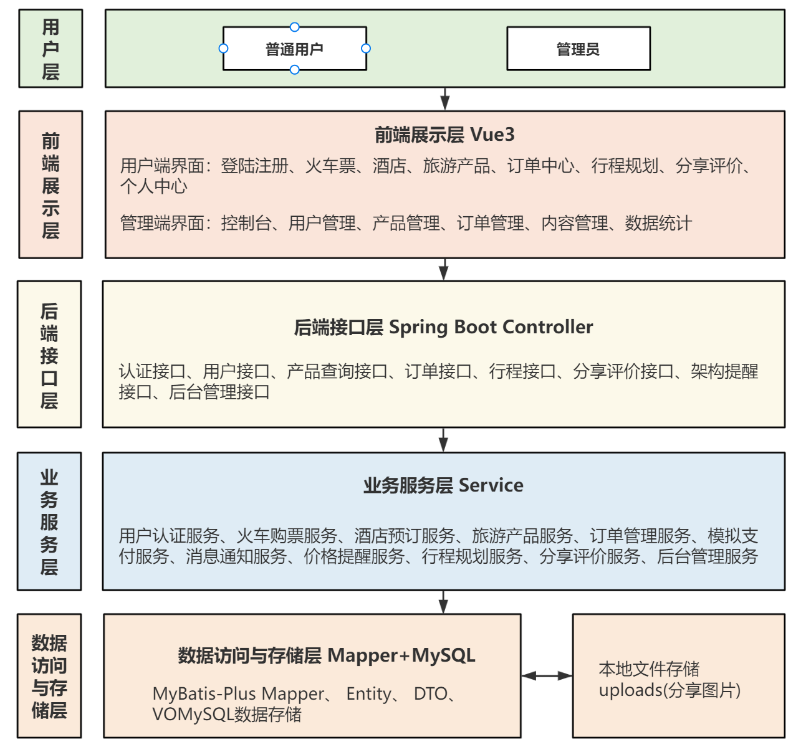
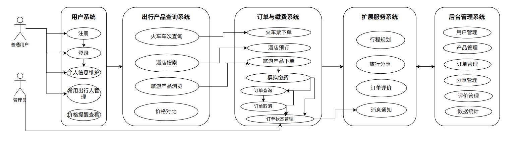

# 软件概要设计说明书

## 1 引言

### 1.1 编写目的

本文档旨在提供“综合出行旅游平台”的概要设计，以便开发团队能够理解系统的整体结构和功能要求。预期读者包括项目开发人员、测试人员和项目管理人员。

**所有业务场景的组件顺序图见 2.5**

### 1.2 背景

开发软件系统名称：综合出行旅游平台

任务提出者：软件工程课设

开发者：有好名字开发小队开发（孙子涵，平心然，李昊阳，焦星普，高昕宇）

运行该软件的计算站（中心）：网页端

### 1.3 定义

- 本文中使用的专门术语和外文首字母组词的原词组的定义如下：

- 用户端：普通用户使用的前台页面，用于查询、预订、下单、评价和管理个人行程

- 管理端：管理员使用的后台页面，用于维护用户、产品、订单、分享和评价内容 

-  JWT：JSON Web Token，用于登录态认证和接口访问控制

- Result：后端统一响应结构，用于封装状态码、消息和业务数据

- 订单主表：`orders` 表，统一保存所有业务订单的公共字段

- 订单明细表：保存不同业务类型的明细

- 模拟缴费：不接入真实支付网关或提供用户支付接口，由管理员通过后台订单状态变化模拟支付完成和后续出行流程

### 1.4 参考设计

- 本项目软件开发计划书

- 本项目软件需求规格说明书

- 12306官网：https://www.12306.cn/index/

- 携程官网： https://www.ctrip.com/

## 2 系统需求概述

### 2.1 需求规定

根据当前课程文档要求和项目实际功能，本系统需求按 14 个可运行的业务场景（用例）组织。需求、概要设计、详细设计、代码、测试和追溯记录统一使用 `REQ01-REQ14` 与 `UC01-UC14` 编号，确保每个用例都能在系统中找到对应的页面、组件、接口、服务、数据表和验证方式。

| 指标 | 数量 | 说明 |
| --- | ---: | --- |
| 业务用例数 | 14 | 覆盖普通用户、游客、管理员三类角色的主要业务场景 |
| 组件顺序图数 | 14 | 2.5 中每个用例配置 1 张组件级顺序图 |
| 总体架构图数 | 2 | 2.7 中配置系统层次结构图和系统模块功能用例图 |
| 追溯编号 | 14 组 | 每组由 `REQxx`、`UCxx`、前端组件、后端组件、数据访问和测试记录组成 |

系统应满足以下需求：

- 支持普通用户注册、登录、退出、个人资料维护和常用出行人管理。
- 支持机票、火车票、酒店和旅游产品的条件查询、列表浏览和详情查看。
- 支持机票、火车票、酒店、旅游产品四类订单创建，统一进入订单中心管理。
- 支持订单列表、订单详情、订单取消、可评价订单查询、订单评价提交和已有评价查看。
- 支持行程规划，包括手工创建行程、维护每日安排、AI 行程预览和 AI 行程保存。
- 支持旅行分享图片上传、分享发布、公开分享浏览、分享详情查看和我的分享查询。
- 支持价格辅助，包括酒店、机票、旅游产品站内价格对比，以及用户价格提醒的创建、查询和删除。
- 支持后台管理，包括管理员认证、数据驾驶舱、用户角色管理、商品数据管理、媒体上传、订单管理、分享与评价内容管理。
- 支持平台支撑能力，包括健康检查、安全访问控制、统一响应与异常处理、本地演示数据初始化和一键启动。
- 支持通过后台修改订单状态模拟支付和后续流转，不接入真实支付平台，也不提供用户支付接口。
- 不设置独立消息通知模块，通过订单状态、价格提醒列表和前端提示反馈业务结果。

### 2.2 业务目标

系统业务目标如下：

- 提供一个覆盖“查询产品-提交订单-后台模拟支付状态-订单管理-评价分享”的完整演示流程
- 将机票、火车、酒店、旅游产品等业务统一纳入订单中心管理
- 通过后台管理端支撑演示数据维护和订单状态流转
- 保持模块边界清晰，便于课程验收、答辩展示和后续扩展
- 避免真实支付和第三方实时 API 依赖，保证本地环境可稳定运行

### 2.3 运行环境

#### 2.3.1 设备

- 客户端设备：PC 浏览器，兼容常见现代浏览器
- 服务端设备：普通开发机或本地服务器，能够运行 JDK、Maven、Node.js 和 MySQL
- 网络环境：本地开发环境默认使用 `localhost`，前端通过 `/api` 代理访问后端服务

#### 2.3.2 支持软件

- 操作系统：Windows 或其他可运行 Java、Node.js、MySQL 的系统 

-  JDK：JDK 17  

- 构建工具：Maven 3.9+  

- 数据库：MySQL 8.x  

- 前端运行环境：Node.js 18+  

- 后端框架：Spring Boot 3、Spring Security、MyBatis-Plus  

- 前端框架：Vue 3、Vite、Vue Router、Pinia、Element Plus、Axios

### 2.4 设计约束

系统设计应考虑隐私性、操作方便性、安全性等因素，遵循相关法律法规和安全标准。

### 2.5 功能需求

#### 2.5.1 UC01 用户注册登录与退出

用户通过普通登录注册页或后台登录页提交账号信息，后端完成参数校验、密码校验、角色读取和 JWT 签发。退出登录时，前端清除本地登录态，后端记录退出行为或使 token 进入失效处理流程。

| 设计项 | 内容 |
| --- | --- |
| 需求编号 | REQ01 |
| 前端组件 | `LoginView.vue`、`AdminLoginView.vue`、`stores/user.js`、`utils/request.js` |
| 后端控制器 | `AuthController`、`AdminAuthController` |
| 业务服务 | `AuthServiceImpl`、`AdminAuthServiceImpl`、`SecurityUserService`、`TokenBlacklistService` |
| 数据访问 | `UserMapper`、`RoleMapper`、`UserRoleMapper` |
| 支撑组件 | `JwtTokenProvider`、`JwtAuthenticationFilter`、`SecurityConfig` |
| 组件级图编号 | COMP-SEQ01 |


#### 2.5.2 UC02 个人资料与常用联系人管理

普通用户在个人中心查看和修改个人资料，并维护常用出行人。后端在保存联系人时校验当前登录用户和数据归属，防止越权访问。

| 设计项 | 内容 |
| --- | --- |
| 需求编号 | REQ02 |
| 前端组件 | `ProfileView.vue`、`api/user.js`、`api/userContact.js` |
| 后端控制器 | `UserController`、`UserContactController` |
| 业务服务 | `UserServiceImpl`、`UserContactServiceImpl` |
| 数据访问 | `UserMapper`、`UserContactMapper` |
| 支撑组件 | `SecurityUtils`、参数校验 DTO |
| 组件级图编号 | COMP-SEQ02 |


#### 2.5.3 UC03 机票查询、详情查看与下单

用户查询航班、查看航班详情并提交机票订单。订单服务负责校验航班状态和库存，生成统一订单主表记录与机票订单明细，并扣减航班库存。

| 设计项 | 内容 |
| --- | --- |
| 需求编号 | REQ03 |
| 前端组件 | `FlightView.vue`、`FlightDetailView.vue`、`FlightBookingView.vue`、`api/flight.js`、`api/order.js` |
| 后端控制器 | `FlightController`、`OrderController` |
| 业务服务 | `FlightServiceImpl`、`OrderServiceImpl` |
| 数据访问 | `FlightMapper`、`OrdersMapper`、`OrderFlightMapper`、`CouponMapper` |
| 支撑组件 | 订单状态常量、业务类型常量、统一异常处理 |
| 组件级图编号 | COMP-SEQ03 |


#### 2.5.4 UC04 火车票查询、详情查看与下单

用户查询火车车次，选择席别并提交火车票订单。订单服务根据席别扣减对应库存字段，并保存火车票订单明细。

| 设计项 | 内容 |
| --- | --- |
| 需求编号 | REQ04 |
| 前端组件 | `TrainView.vue`、`TrainDetailView.vue`、`TrainBookingView.vue`、`api/train.js`、`api/order.js` |
| 后端控制器 | `TrainController`、`OrderController` |
| 业务服务 | `TrainServiceImpl`、`OrderServiceImpl` |
| 数据访问 | `TrainTicketMapper`、`OrdersMapper`、`OrderTrainMapper`、`CouponMapper` |
| 支撑组件 | 席别价格和库存校验、订单状态常量 |
| 组件级图编号 | COMP-SEQ04 |


#### 2.5.5 UC05 酒店查询、详情查看与预订

用户查询酒店，查看房型并提交酒店预订。酒店服务负责展示酒店和房型，订单服务负责校验入住日期、房型库存并生成酒店订单。

| 设计项 | 内容 |
| --- | --- |
| 需求编号 | REQ05 |
| 前端组件 | `HotelView.vue`、`HotelDetailView.vue`、`HotelBookingView.vue`、`api/hotel.js`、`api/order.js` |
| 后端控制器 | `HotelController`、`OrderController` |
| 业务服务 | `HotelServiceImpl`、`OrderServiceImpl` |
| 数据访问 | `HotelMapper`、`HotelRoomMapper`、`OrdersMapper`、`OrderHotelMapper`、`CouponMapper` |
| 支撑组件 | 日期校验、房型库存校验、订单状态常量 |
| 组件级图编号 | COMP-SEQ05 |


#### 2.5.6 UC06 旅游产品浏览、详情查看与下单

用户浏览旅游产品，查看详情并提交订单。系统校验产品状态、库存和出行信息，创建旅游产品订单。

| 设计项 | 内容 |
| --- | --- |
| 需求编号 | REQ06 |
| 前端组件 | `TourView.vue`、`TourDetailView.vue`、`TourBookingView.vue`、`api/tour.js`、`api/order.js` |
| 后端控制器 | `TourController`、`OrderController` |
| 业务服务 | `TourServiceImpl`、`OrderServiceImpl` |
| 数据访问 | `TourPackageMapper`、`OrdersMapper`、`OrderTourMapper`、`CouponMapper` |
| 支撑组件 | 产品状态校验、库存扣减、订单状态常量 |
| 组件级图编号 | COMP-SEQ06 |


#### 2.5.7 UC07 订单查询、详情查看与取消

用户在订单中心查看统一订单列表、订单详情并取消允许取消的订单。取消订单时，订单服务需要根据业务类型恢复对应产品库存。

| 设计项 | 内容 |
| --- | --- |
| 需求编号 | REQ07 |
| 前端组件 | `OrderView.vue`、`OrderDetailView.vue`、`OrderDetailPanel.vue`、`api/order.js` |
| 后端控制器 | `OrderController` |
| 业务服务 | `OrderServiceImpl` |
| 数据访问 | `OrdersMapper`、`OrderFlightMapper`、`OrderTrainMapper`、`OrderHotelMapper`、`OrderTourMapper`、产品 Mapper |
| 支撑组件 | 订单状态常量、业务类型常量、用户归属校验 |
| 组件级图编号 | COMP-SEQ07 |


#### 2.5.8 UC08 已完成订单评价

用户对已完成且未评价订单提交评价。评价服务校验订单归属、订单状态和重复评价约束后写入评价表。

| 设计项 | 内容 |
| --- | --- |
| 需求编号 | REQ08 |
| 前端组件 | `OrderView.vue`、`OrderDetailView.vue`、`ReviewDialog.vue`、`api/review.js` |
| 后端控制器 | `ReviewController` |
| 业务服务 | `ReviewServiceImpl`、`OrderServiceImpl` |
| 数据访问 | `ReviewMapper`、`OrdersMapper` |
| 支撑组件 | 订单状态校验、重复评价校验、用户归属校验 |
| 组件级图编号 | COMP-SEQ08 |


#### 2.5.9 UC09 手动行程规划管理

用户创建行程计划并维护每日安排。行程服务负责校验行程归属，行程项按行程主表关联保存。

| 设计项 | 内容 |
| --- | --- |
| 需求编号 | REQ09 |
| 前端组件 | `TripPlanView.vue`、`TripPlanDetailView.vue`、`api/tripPlan.js` |
| 后端控制器 | `TripPlanController` |
| 业务服务 | `TripPlanServiceImpl` |
| 数据访问 | `TripPlanMapper`、`TripPlanItemMapper` |
| 支撑组件 | 用户归属校验、行程日期和内容校验 |
| 组件级图编号 | COMP-SEQ09 |


#### 2.5.10 UC10 AI 或本地规则生成行程并保存

用户输入目的地、天数、日期和偏好后，系统从本地景点库获取候选景点，优先调用 AI 生成预览；当 AI 不可用时使用本地规则回退，用户确认后保存为正式行程。

| 设计项 | 内容 |
| --- | --- |
| 需求编号 | REQ10 |
| 前端组件 | `TripPlanView.vue`、`api/tripPlan.js` |
| 后端控制器 | `TripPlanController` |
| 业务服务 | `AiTripPlanServiceImpl`、`TripPlanServiceImpl` |
| 数据访问 | `AttractionMapper`、`TripPlanMapper`、`TripPlanItemMapper` |
| 支撑组件 | `AiPlannerProperties`、本地规则回退、外部 AI 调用超时控制 |
| 组件级图编号 | COMP-SEQ10 |


#### 2.5.11 UC11 旅行分享发布与浏览

游客和普通用户可浏览公开分享；登录用户可上传图片并发布旅行分享。分享正文和图片路径分别保存到分享表和分享图片表。

| 设计项 | 内容 |
| --- | --- |
| 需求编号 | REQ11 |
| 前端组件 | `ShareListView.vue`、`ShareCreateView.vue`、`ShareDetailView.vue`、`api/share.js` |
| 后端控制器 | `ShareController` |
| 业务服务 | `ShareServiceImpl`、`MediaUploadServiceImpl` |
| 数据访问 | `SharePostMapper`、`ShareImageMapper` |
| 支撑组件 | 本地上传目录、图片访问映射、内容状态控制 |
| 组件级图编号 | COMP-SEQ11 |


#### 2.5.12 UC12 价格对比与价格提醒

用户查看商品站内价格对比并创建目标价格提醒。价格对比基于本地商品和优惠券数据模拟，价格提醒归当前用户所有。

| 设计项 | 内容 |
| --- | --- |
| 需求编号 | REQ12 |
| 前端组件 | `PriceComparePanel.vue`、`PriceAlertDialog.vue`、`ProfileView.vue`、`api/price.js`、`api/priceAlert.js` |
| 后端控制器 | `PriceCompareController`、`PriceAlertController` |
| 业务服务 | `PriceCompareServiceImpl`、`PriceAlertServiceImpl` |
| 数据访问 | `CouponMapper`、`FlightMapper`、`HotelMapper`、`TourPackageMapper`、`PriceAlertMapper` |
| 支撑组件 | 商品类型标准化、用户归属校验 |
| 组件级图编号 | COMP-SEQ12 |


#### 2.5.13 UC13 管理员商品与图片管理

管理员维护航班、车次、酒店、房型、旅游产品和商品图片。后台商品服务负责字段校验和商品表写入，媒体服务负责保存上传文件并返回访问路径。

| 设计项 | 内容 |
| --- | --- |
| 需求编号 | REQ13 |
| 前端组件 | `FlightManageView.vue`、`TrainManageView.vue`、`HotelManageView.vue`、`HotelRoomManageView.vue`、`TourManageView.vue`、`AdminCrudPage.vue`、`api/admin.js` |
| 后端控制器 | `AdminProductManageController`、`AdminMediaController` |
| 业务服务 | `AdminProductManageServiceImpl`、`MediaUploadServiceImpl` |
| 数据访问 | `FlightMapper`、`TrainTicketMapper`、`HotelMapper`、`HotelRoomMapper`、`TourPackageMapper` |
| 支撑组件 | 管理员权限校验、图片上传限制、商品字段校验 |
| 组件级图编号 | COMP-SEQ13 |


#### 2.5.14 UC14 管理员用户、订单、内容管理

管理员在后台查看数据概览，管理用户状态和角色，修改订单状态或后台取消订单，删除违规分享和评价。

| 设计项 | 内容 |
| --- | --- |
| 需求编号 | REQ14 |
| 前端组件 | `DashboardView.vue`、`UserManageView.vue`、`OrderManageView.vue`、`AdminOrderDetailView.vue`、`ShareManageView.vue`、`ReviewManageView.vue`、`api/admin.js` |
| 后端控制器 | `AdminDashboardController`、`AdminUserManageController`、`AdminOrderManageController`、`AdminContentManageController` |
| 业务服务 | `AdminDashboardServiceImpl`、`AdminUserManageServiceImpl`、`AdminOrderManageServiceImpl`、`AdminContentManageServiceImpl` |
| 数据访问 | `UserMapper`、`UserRoleMapper`、`OrdersMapper`、订单明细 Mapper、`SharePostMapper`、`ReviewMapper` |
| 支撑组件 | 管理员权限校验、订单状态流转校验、内容删除校验 |
| 组件级图编号 | COMP-SEQ14 |


### 2.6 非功能需求

- 可用性：页面流程清晰，普通用户可完成查询、下单、订单查看、评价等核心操作  
- 可靠性：订单创建、取消、评价等关键操作由后端校验状态和业务规则  
- 安全性：使用 JWT 认证，密码加密存储，后台接口限制管理员角色访问 
- 可维护性：后端按 controller/service/mapper/entity/dto/vo 分层，前端按 views/api/router/store 分层
- 可扩展性：订单采用主表加业务明细表结构，可扩展新业务类型
- 可测试性：本地初始化脚本提供演示数据，可支持端到端流程验证

### 2.7 系统总体架构

<center><b>系统层次结构图</b></center>




<center><b>系统模块功能用例图</b></center>



## 3 系统接口设计

### 3.1 接口设计原则

- 使用 REST 风格组织 URL。
- 使用 JSON 作为请求和响应数据格式。
- 后端统一返回 `Result`：

```json
{
  "code": 200,
  "message": "操作成功",
  "data": {}
}
```

- 公共查询接口允许未登录访问。
- 用户业务接口需要普通登录态。
- 后台接口需要管理员角色。
- 前端通过 Vite 代理将 `/api` 转发到 `http://localhost:8080`。

### 3.2 接口设计

#### 3.2.1 接口分层

系统接口按访问权限分为公共接口、前台登录用户接口、后台管理员接口和平台支撑接口。

| 接口类型 | 路径特征 | 访问控制 | 主要用途 |
| --- | --- | --- | --- |
| 公共查询接口 | `/api/public/**` | 允许未登录访问 | 产品列表、产品详情、公开分享、价格对比、健康检查 |
| 前台用户接口 | `/api/auth/**`、`/api/users/**`、`/api/orders/**` 等 | 登录接口公开，其他接口需要普通用户 JWT | 认证、个人资料、常用出行人、下单、订单、评价、行程、分享、价格提醒 |
| 后台管理接口 | `/api/admin/**` | 需要管理员角色 JWT | 后台登录、驾驶舱、用户角色、商品、订单、内容和媒体管理 |
| 横切支撑接口 | 安全过滤器、统一响应、异常处理 | 由 Spring Security 和全局异常处理器控制 | 鉴权授权、统一返回结构、异常响应 |

#### 3.2.2 HTTP 接口与业务用例追溯清单

本节按 `UC01-UC14` 组织接口，避免旧版文档中按零散系统操作拆成多个用例后与当前业务场景清单不一致的问题。每个用例至少包含一个可运行入口，接口实现可在对应 Controller、Service 和 Mapper 中追溯。

| 用例编号 | 需求编号 | 关键接口 | 控制器 | 说明 |
| --- | --- | --- | --- | --- |
| UC01 | REQ01 | `POST /api/auth/register`、`POST /api/auth/login`、`POST /api/auth/logout`、`POST /api/admin/auth/login`、`GET /api/admin/auth/me` | `AuthController`、`AdminAuthController` | 用户和管理员认证入口，完成注册、登录、退出和登录态查询。 |
| UC02 | REQ02 | `GET /api/users/me`、`PUT /api/users/me`、`GET/POST/PUT/DELETE /api/user-contacts` | `UserController`、`UserContactController` | 当前用户资料维护和常用出行人管理。 |
| UC03 | REQ03 | `GET /api/public/flights`、`GET /api/public/flights/{id}`、`POST /api/orders/flights` | `FlightController`、`OrderController` | 机票查询、详情查看与机票订单创建。 |
| UC04 | REQ04 | `GET /api/public/trains`、`GET /api/public/trains/{id}`、`POST /api/orders/trains` | `TrainController`、`OrderController` | 火车票查询、详情查看与火车票订单创建。 |
| UC05 | REQ05 | `GET /api/public/hotels`、`GET /api/public/hotels/{id}`、`POST /api/orders/hotels` | `HotelController`、`OrderController` | 酒店查询、房型详情查看与酒店订单创建。 |
| UC06 | REQ06 | `GET /api/public/tours`、`GET /api/public/tours/{id}`、`POST /api/orders/tours` | `TourController`、`OrderController` | 旅游产品浏览、详情查看与旅游产品订单创建。 |
| UC07 | REQ07 | `GET /api/orders`、`GET /api/orders/{id}`、`POST /api/orders/{id}/cancel` | `OrderController` | 用户订单列表、订单详情和订单取消。 |
| UC08 | REQ08 | `GET /api/orders/reviewable`、`POST /api/reviews`、`GET /api/orders/{id}/review` | `ReviewController`、`OrderController` | 已完成订单评价、可评价订单查询和已有评价查看。 |
| UC09 | REQ09 | `GET/POST /api/trip-plans`、`GET/PUT/DELETE /api/trip-plans/{id}`、`POST/PUT/DELETE /api/trip-plans/{planId}/items/{itemId}` | `TripPlanController` | 手动行程计划和每日安排维护。 |
| UC10 | REQ10 | `POST /api/trip-plans/ai-preview`、`POST /api/trip-plans/ai-save` | `TripPlanController` | AI 或本地规则行程生成预览与保存。 |
| UC11 | REQ11 | `GET /api/public/shares`、`GET /api/public/shares/{id}`、`POST /api/shares/upload`、`POST /api/shares`、`GET /api/shares/mine` | `ShareController` | 旅行分享浏览、图片上传、发布和我的分享查询。 |
| UC12 | REQ12 | `GET /api/public/price-compare/hotels/{id}`、`GET /api/public/price-compare/flights/{id}`、`GET /api/public/price-compare/tours/{id}`、`GET/POST/DELETE /api/price-alerts` | `PriceCompareController`、`PriceAlertController` | 站内价格对比和用户价格提醒管理。 |
| UC13 | REQ13 | `/api/admin/flights`、`/api/admin/trains`、`/api/admin/hotels`、`/api/admin/hotel-rooms`、`/api/admin/tours`、`POST /api/admin/media/upload` | `AdminProductManageController`、`AdminMediaController` | 管理员商品数据和商品图片维护。 |
| UC14 | REQ14 | `GET /api/admin/dashboard`、`/api/admin/users`、`/api/admin/roles`、`/api/admin/orders`、`/api/admin/shares`、`/api/admin/reviews` | `AdminDashboardController`、`AdminUserManageController`、`AdminOrderManageController`、`AdminContentManageController` | 管理员数据概览、用户、订单、分享和评价管理。 |

#### 3.2.3 外部软件、硬件接口安排

数据库接口：系统与 MySQL 数据库之间的接口用于存储和检索用户信息、角色权限、出行产品、订单、行程、分享、评价、优惠券、价格提醒和景点数据。

前端接口：系统通过浏览器访问前端页面，前端使用 HTTP/JSON 与后端接口交互，完成查询、预订、下单、评价、行程、分享和后台管理等操作。

支付接口：系统当前不接入真实支付平台，也不提供独立支付接口；管理员通过后台订单管理将订单从待支付调整为待出行、已完成或已取消等状态，以模拟订单支付及后续流程。

消息通知接口：系统当前未设置独立消息通知接口，采用订单状态、价格提醒列表和前端提示反馈订购结果。

第三方交通与酒店接口：系统当前使用本地数据库中的航班、车次、酒店和旅游产品演示数据，不接入真实航司、铁路、酒店或 OTA 平台接口。

文件上传接口：系统通过本地上传目录保存旅行分享图片和后台商品图片，前端上传图片后由后端返回图片访问路径。

AI 行程接口：系统可通过 OpenAI 兼容接口优化本地景点推荐结果；未配置密钥或调用失败时自动使用本地规则生成，保证基础行程规划可用。

硬件接口：系统不直接访问打印机、读卡器、支付终端等硬件设备；用户通过浏览器页面、键盘、鼠标或触摸板完成操作，服务端运行在普通服务器或开发机上。

#### 3.2.4 系统元素间接口安排

用户模块与订单模块的接口：用户模块通过用户 ID 关联订单模块，用于查询和管理用户的订单信息。

产品模块与订单模块的接口：机票、火车票、酒店和旅游产品模块创建订单后，通过订单 ID 关联订单明细，并在订单创建、取消时扣减或恢复库存。

订单模块与评价模块的接口：评价模块通过订单 ID 判断订单是否可评价、是否已评价，并记录评分和评价内容。

行程规划模块与景点模块的接口：AI 行程生成通过目的地、日期、偏好和本地景点库生成预览结果，并保存为行程计划与每日安排。

分享模块与媒体模块的接口：分享发布时读取上传图片路径，保存分享正文和图片列表，公开分享详情按分享 ID 读取图片。

后台管理模块与业务模块的接口：后台管理模块通过管理接口访问用户、产品、订单、分享和评价数据，用于系统运营维护和演示数据管理。

### 3.3 系统数据结构设计

#### 3.3.1 逻辑结构设计要点

用户数据结构（User）

- 标识符：`userID`
- 数据项：
  - 用户名（`username`）
  - 密码（`password`）
  - 昵称（`nickname`）
  - 真实姓名（`realName`）
  - 手机号（`phone`）
  - 邮箱（`email`）
  - 性别（`gender`）
  - 用户状态（`status`）
  - 最后登录时间（`lastLoginTime`）

角色数据结构（Role）

- 标识符：`roleID`
- 数据项：
  - 角色编码（`roleCode`）
  - 角色名称（`roleName`）
  - 角色状态（`status`）

常用出行人数据结构（UserContact）

- 标识符：`contactID`
- 数据项：
  - 所属用户（`userID`）
  - 姓名（`name`）
  - 联系电话（`phone`）
  - 身份证号（`idCard`）
  - 出行人类型（`contactType`）
  - 是否默认（`isDefault`）
  - 备注（`remark`）

航班数据结构（Flight）

- 标识符：`flightID`
- 数据项：
  - 航班号（`flightNo`）
  - 航空公司（`airlineName`）
  - 出发城市与到达城市（`departureCity`、`arrivalCity`）
  - 出发机场与到达机场（`departureAirport`、`arrivalAirport`）
  - 起飞时间与到达时间（`departureTime`、`arrivalTime`）
  - 价格与库存（`price`、`stock`）
  - 舱位、行李和退改规则（`cabinClass`、`baggagePolicy`、`refundPolicy`）
  - 航班状态（`status`）

火车车次数据结构（Train）

- 标识符：`trainID`
- 数据项：
  - 车次号（`trainNo`）
  - 车次类型（`trainType`）
  - 出发城市（`departureCity`）
  - 到达城市（`arrivalCity`）
  - 出发站（`departureStation`）
  - 到达站（`arrivalStation`）
  - 出发时间（`departureTime`）
  - 到达时间（`arrivalTime`）
  - 历时分钟数（`durationMinutes`）
  - 座位类型和价格（`businessPrice`、`firstClassPrice`、`secondClassPrice`）
  - 座位库存（`businessStock`、`firstClassStock`、`secondClassStock`）

酒店数据结构（Hotel）

- 标识符：`hotelID`
- 数据项：
  - 酒店名称（`hotelName`）
  - 所在城市（`city`）
  - 所在区域（`district`）
  - 详细地址（`address`）
  - 酒店描述（`description`）
  - 星级（`starLevel`）
  - 封面图片（`coverImage`）
  - 入住时间（`checkInTime`）
  - 离店时间（`checkOutTime`）
  - 酒店状态（`status`）

房型数据结构（HotelRoom）

- 标识符：`roomID`
- 数据项：
  - 所属酒店（`hotelID`）
  - 房型名称（`roomName`）
  - 床型（`bedType`）
  - 早餐信息（`breakfast`）
  - 房间面积（`roomArea`）
  - 可住人数（`guestCount`）
  - 房型价格（`price`）
  - 房型库存（`stock`）
  - 取消规则（`cancelRule`）

旅游产品数据结构（TourPackage）

- 标识符：`tourID`
- 数据项：
  - 产品名称（`packageName`）
  - 目的地（`destination`）
  - 出发城市（`departureCity`）
  - 行程天数（`days`）
  - 产品价格（`price`）
  - 产品库存（`stock`）
  - 可出行日期（`travelDates`）
  - 产品描述（`description`）
  - 封面图片（`coverImage`）

订单数据结构（Order）

- 标识符：`orderID`
- 数据项：
  - 订单编号（`orderNo`）
  - 所属用户（`userID`）
  - 业务类型（`bizType`）
  - 业务对象编号（`bizID`）
  - 订单状态（`orderStatus`）
  - 原始金额（`originalAmount`）
  - 优惠金额（`discountAmount`）
  - 实付金额（`totalAmount`）
  - 优惠券编号（`couponID`）
  - 联系人姓名（`contactName`）
  - 联系人电话（`contactPhone`）
  - 出行日期（`travelDate`）

订单明细数据结构（OrderFlight、OrderTrain、OrderHotel、OrderTour）

- 标识符：各业务明细表主键 ID
- 数据项：
  - 所属订单（`orderID`）
  - 业务对象编号（航班、车次、房型或旅游产品编号）
  - 出行人或入住人信息
  - 业务专有字段，例如舱位、席别、入住离店日期、房间数、旅游产品出行日期等
  - 业务快照字段，例如产品名称、路线、价格和库存扣减信息

行程计划数据结构（TripPlan）

- 标识符：`planID`
- 数据项：
  - 所属用户（`userID`）
  - 行程名称（`planName`）
  - 总天数（`totalDays`）
  - 开始日期（`startDate`）
  - 来源类型（`sourceType`）
  - 备注（`remark`）

每日行程项数据结构（TripPlanItem）

- 标识符：`itemID`
- 数据项：
  - 所属行程（`planID`）
  - 第几天（`dayNo`）
  - 目的地（`destination`）
  - 酒店安排（`hotel`）
  - 交通方式（`transportType`）
  - 备注（`remark`）

分享数据结构（SharePost）

- 标识符：`postID`
- 数据项：
  - 发布用户（`userID`）
  - 标题（`title`）
  - 摘要（`summary`）
  - 正文内容（`content`）
  - 封面图片（`coverImage`）
  - 浏览次数（`viewCount`）
  - 点赞次数（`likeCount`）
  - 内容状态（`status`）

分享图片数据结构（ShareImage）

- 标识符：`imageID`
- 数据项：
  - 所属分享（`postID`）
  - 图片访问路径（`imageUrl`）
  - 图片排序号（`sortOrder`）

评价数据结构（Review）

- 标识符：`reviewID`
- 数据项：
  - 订单编号（`orderID`）
  - 评价用户（`userID`）
  - 业务类型（`bizType`）
  - 业务对象编号（`bizID`）
  - 评分（`rating`）
  - 评价内容（`content`）
  - 评价状态（`status`）

优惠券数据结构（Coupon）

- 标识符：`couponID`
- 数据项：
  - 优惠券名称（`couponName`）
  - 适用产品类型（`productType`）
  - 优惠类型与优惠金额（`discountType`、`discountAmount`）
  - 使用门槛（`minAmount`）
  - 有效期（`startTime`、`endTime`）
  - 优惠券状态（`status`）

价格提醒数据结构（PriceAlert）

- 标识符：`alertID`
- 数据项：
  - 所属用户（`userID`）
  - 产品类型（`productType`）
  - 产品编号（`productID`）
  - 目标价格（`targetPrice`）
  - 提醒状态（`status`）
  - 备注（`remark`）

景点数据结构（Attraction）

- 标识符：`attractionID`
- 数据项：
  - 城市和区域（`city`、`district`）
  - 景点名称和类型（`attractionName`、`attractionType`）
  - 标签与描述（`tags`、`description`）
  - 建议游玩时长（`suggestedDuration`）
  - 推荐优先级和状态（`priority`、`status`）

#### 3.3.2 物理结构设计要点

用户数据结构（User）：

- 存储要求：用户信息存储在用户表（`user`）中，密码采用加密字符串保存
- 访问方法：通过 `userID` 或 `username` 访问用户信息。
- 存取单位：整个用户记录
- 存取物理关系：用户表存储在 MySQL 数据库中，通过用户名唯一索引和手机号唯一索引实现快速访问。

角色数据结构（Role）：

- 存储要求：角色信息存储在角色表（`role`）中，用户与角色关系存储在用户角色关系表（`user_role`）中
- 访问方法：通过 `roleID`、`roleCode` 或 `userID` 查询角色信息
- 存取单位：单条角色记录或单条用户角色关系记录
- 存取物理关系：角色表通过角色编码唯一索引保证角色唯一，用户角色关系表通过联合唯一索引保证同一用户不重复绑定同一角色

常用出行人数据结构（UserContact）：

- 存储要求：常用出行人信息存储在常用出行人表（`user_contact`）中
- 访问方法：通过 `contactID` 访问单个出行人，通过 `userID` 查询用户全部常用出行人
- 存取单位：整个常用出行人记录
- 存取物理关系：常用出行人表通过 `user_id` 索引加速个人中心和下单页的数据读取

航班数据结构（Flight）：

- 存储要求：航班信息存储在航班表（`flight`）中
- 访问方法：通过 `flightID` 访问航班详情，通过出发城市、到达城市和起飞时间查询航班列表
- 存取单位：整个航班记录
- 存取物理关系：航班表通过路线日期索引（`departure_city`、`arrival_city`、`departure_time`）提升查询效率

火车车次数据结构（Train）：

- 存储要求：火车车次信息存储在火车票表（`train_ticket`）中
- 访问方法：通过 `trainID` 访问车次详情，通过出发城市、到达城市和出发时间查询车次列表
- 存取单位：整个车次记录
- 存取物理关系：火车票表通过路线日期索引（`departure_city`、`arrival_city`、`departure_time`）提升查询效率

酒店数据结构（Hotel）：

- 存储要求：酒店信息存储在酒店表（`hotel`）中
- 访问方法：通过 `hotelID` 访问酒店详情，通过城市和状态查询酒店列表
- 存取单位：整个酒店记录
- 存取物理关系：酒店表通过城市状态索引（`city`、`status`）加速酒店搜索

房型数据结构（HotelRoom）：

- 存储要求：房型信息存储在酒店房型表（`hotel_room`）中
- 访问方法：通过 `roomID` 访问房型详情，通过 `hotelID` 查询某酒店下全部房型
- 存取单位：整个房型记录
- 存取物理关系：酒店房型表通过 `hotel_id` 索引建立与酒店表的物理查询关系

旅游产品数据结构（TourPackage）：

- 存储要求：旅游产品信息存储在旅游产品表（`tour_package`）中
- 访问方法：通过 `tourID` 访问产品详情，通过目的地和状态查询产品列表
- 存取单位：整个旅游产品记录
- 存取物理关系：旅游产品表通过目的地状态索引（`destination`、`status`）提升列表筛选效率

订单数据结构（Order）：

- 存储要求：订单公共信息存储在订单主表（`orders`）中，不同业务订单明细分别存储在 `order_flight`、`order_train`、`order_hotel`、`order_tour` 表中
- 访问方法：通过 `orderID` 或 `orderNo` 访问订单详情，通过 `userID`、`bizType`、`orderStatus` 查询订单列表
- 存取单位：订单主记录及其对应的一条业务明细记录
- 存取物理关系：订单主表通过订单号唯一索引保证订单唯一，通过用户订单查询索引（`user_id`、`biz_type`、`order_status`、`id`）加速订单中心查询；各订单明细表通过 `order_id` 索引关联订单主表

行程计划数据结构（TripPlan）：

- 存储要求：行程主信息存储在行程计划表（`trip_plan`）中，每日安排存储在行程明细表（`trip_plan_item`）中
- 访问方法：通过 `planID` 访问行程详情，通过 `userID` 查询用户行程列表
- 存取单位：行程主记录及其多个每日行程项记录
- 存取物理关系：行程计划表通过 `user_id` 索引按用户查询，行程明细表通过 `plan_id` 索引关联主表，并通过（`plan_id`、`day_no`）联合唯一索引避免同一天重复记录

分享数据结构（SharePost）：

- 存储要求：分享正文信息存储在分享表（`share_post`）中，分享图片路径存储在分享图片表（`share_image`）中，图片文件保存到后端本地上传目录
- 访问方法：通过 `postID` 访问分享详情，通过状态和发布时间查询公开分享列表
- 存取单位：分享主记录及其图片记录
- 存取物理关系：分享表通过用户索引和状态索引支持后台管理与公开列表查询，分享图片表通过 `post_id` 索引关联分享主表

评价数据结构（Review）：

- 存储要求：订单评价信息存储在评价表（`review`）中
- 访问方法：通过 `reviewID` 访问评价记录，通过 `orderID` 查询某订单评价，通过业务类型和业务对象编号查询产品相关评价
- 存取单位：整个评价记录
- 存取物理关系：评价表通过 `order_id` 唯一索引保证一个订单只能评价一次，通过（`biz_type`、`biz_id`）索引支持按产品聚合评价

价格提醒数据结构（PriceAlert）：

- 存储要求：价格提醒信息存储在价格提醒表（`price_alert`）中
- 访问方法：通过 `alertID` 访问提醒详情，通过 `userID` 查询用户提醒列表，通过产品类型和产品编号查询产品提醒
- 存取单位：整个价格提醒记录
- 存取物理关系：价格提醒表通过 `user_id` 索引支持个人中心查询，通过（`product_type`、`product_id`）索引支持按产品查询提醒记录

景点数据结构（Attraction）：

- 存储要求：景点信息存储在景点表（`attraction`）中，作为 AI 行程规划的本地候选数据
- 访问方法：通过城市和状态查询可推荐景点
- 存取单位：整个景点记录
- 存取物理关系：景点表通过城市状态索引（`city`、`status`）加速候选景点查询

优惠券数据结构（Coupon）：

- 存储要求：优惠券信息存储在优惠券表（`coupon`）中
- 访问方法：通过 `couponID` 访问优惠券详情，通过产品类型和状态筛选可用优惠券
- 存取单位：整个优惠券记录
- 存取物理关系：优惠券表通过（`product_type`、`status`）索引支持下单页和价格对比模块快速读取可用优惠信息

#### 3.3.3 数据结构与程序关系

- 用户数据结构（User）：程序通过用户 ID（`userID`）或用户名（`username`）访问用户信息，用于用户注册、登录验证、查询当前用户资料、修改个人信息和后台用户管理等操作
- 角色数据结构（Role）：程序通过角色编码（`roleCode`）和用户角色关系判断用户权限，用于区分普通用户与管理员，并控制后台页面和后台接口访问
- 常用出行人数据结构（UserContact）：程序根据当前登录用户 ID 查询常用出行人列表，在机票、火车票、酒店、旅游产品下单时提供出行人或入住人选择功能
- 航班数据结构（Flight）：程序根据出发城市、到达城市和日期查询航班，在详情页展示机场、舱位、价格、库存和退改规则，并提供机票下单功能
- 火车车次数据结构（Train）：程序根据用户选择的出发城市、到达城市和出发日期查询符合条件的火车车次信息，并在详情页提供座位类型、价格、余票和预订功能
- 酒店数据结构（Hotel）：程序根据用户选择的目的地或城市搜索酒店信息，查询酒店详情，并结合房型数据提供酒店预订功能
- 房型数据结构（HotelRoom）：程序根据酒店 ID 查询房型列表，在酒店详情页展示床型、早餐、价格、库存和取消规则，并在预订时计算订单金额
- 旅游产品数据结构（TourPackage）：程序根据目的地、出发城市等条件查询旅游产品信息，在详情页展示行程天数、价格、库存和可出行日期，并提供旅游产品下单功能
- 订单数据结构（Order）：程序根据用户 ID 查询历史订单，按照业务类型和订单状态筛选订单，并提供订单详情查看、订单取消和后台状态修改功能
- 订单明细数据结构（OrderDetail）：程序根据订单业务类型读取对应明细数据，例如火车票订单读取 `OrderTrain`，酒店订单读取 `OrderHotel`，用于展示不同业务订单的专有信息
- 行程计划数据结构（TripPlan）：程序根据用户 ID 查询行程计划列表，通过行程 ID 读取行程详情，并提供创建、修改、删除行程计划的功能
- 每日行程项数据结构（TripPlanItem）：程序根据行程 ID 查询每日安排，用于维护每天的目的地、酒店、交通方式和备注信息，并在行程详情页结构化展示
- 分享数据结构（SharePost）：程序读取公开分享列表和分享详情，用于旅行内容浏览；登录用户可创建分享，管理员可在后台管理分享内容
- 分享图片数据结构（ShareImage）：程序在用户发布分享时保存图片访问路径，在分享详情页根据分享 ID 加载对应图片
- 评价数据结构（Review）：程序根据订单 ID 判断订单是否已评价，并在订单完成后允许用户提交评分和评价内容；后台可查看和删除评价
- 优惠券数据结构（Coupon）：程序根据产品类型和订单金额筛选可用优惠券，在价格对比和下单时用于展示优惠信息和计算优惠金额
- 价格提醒数据结构（PriceAlert）：程序根据用户 ID 查询个人价格提醒列表，根据产品类型和产品 ID 创建提醒记录，用于前台价格提醒展示
- 景点数据结构（Attraction）：程序根据目的地和偏好从本地景点库筛选候选景点，供 AI 行程预览和本地回退生成使用

## 4 系统数据库设计

### 4.1 数据库选择

系统选择 MySQL 8.x 作为关系型数据库，原因如下：

- 适合保存用户、订单、产品等结构化数据
- 支持事务，满足订单创建、取消、评价等一致性要求
- 与 Spring Boot、MyBatis-Plus 集成成熟
- 便于课程项目本地部署和演示

### 4.2 数据库表设计

系统的数据库将包括以下主要的数据表：

1. 用户信息表（`user`）：包括用户账号、密码、昵称、联系方式、状态等
2. 角色信息表（`role`）：记录普通用户、管理员等角色信息，并通过 `user_role` 与用户关联
3. 常用出行人表（`user_contact`）：保存用户维护的乘车人、入住人等常用联系人信息
4. 航班信息表（`flight`）：记录航班号、航空公司、机场、起降时间、价格和库存等
5. 火车车次信息表（`train_ticket`）：记录车次号、出发站、到达站、出发时间、座位类型、价格和库存等
6. 酒店信息表（`hotel`）：存储酒店名称、城市、地址、星级、状态等信息
7. 酒店房型表（`hotel_room`）：存储房型名称、床型、价格、库存、取消规则等
8. 旅游产品表（`tour_package`）：记录目的地、出发城市、行程天数、价格、库存等
9. 订单信息表（`orders`）：记录订单号、用户 ID、业务类型、订单金额、订单状态等
10. 订单明细表（`order_flight`、`order_train`、`order_hotel`、`order_tour`）：分别保存不同业务订单的详细信息
11. 行程规划表（`trip_plan`、`trip_plan_item`）：保存用户行程计划和每日安排
12. 分享评价表（`share_post`、`share_image`、`review`）：保存旅行分享、图片和订单评价内容
13. 价格相关表（`coupon`、`price_alert`）：保存优惠券和价格提醒信息
14. 景点信息表（`attraction`）：保存 AI 行程规划使用的本地景点候选数据

### 4.3 数据库关系设计

系统的数据库表之间存在以下关系：

- 用户与角色关系：多对多关系，一个用户可以拥有多个角色
- 用户与订单关系：一对多关系，一个用户可以有多个订单
- 用户与常用出行人关系：一对多关系，一个用户可以维护多个常用出行人
- 航班与订单关系：一对多关系，一个航班可以对应多个机票订单
- 火车车次与订单关系：一对多关系，一个车次可以对应多个火车票订单
- 酒店与房型关系：一对多关系，一个酒店可以包含多个房型
- 酒店与订单关系：一对多关系，一个酒店可以对应多个酒店订单
- 旅游产品与订单关系：一对多关系，一个旅游产品可以对应多个旅游产品订单
- 订单与评价关系：一对一关系，一个订单只能评价一次
- 行程与每日安排关系：一对多关系，一个行程计划可以包含多天安排
- 用户与旅行分享关系：一对多关系，一个用户可以发布多篇旅行分享
- 分享与图片关系：一对多关系，一篇分享可以包含多张图片
- 产品与价格提醒关系：一对多关系，同一产品可以被多个用户创建价格提醒
- 产品与优惠券关系：一对多关系，同一产品类型可以关联多条可用优惠券

### 4.4 数据库索引设计

- 在用户信息表中创建用户名索引，加快登录和用户查询速度
- 在订单信息表中创建用户 ID 索引，加快根据用户查询订单的速度
- 在航班信息表中创建出发地、目的地和起飞时间索引，便于快速检索航班
- 在火车车次信息表中创建出发地、目的地和出发时间索引，便于快速检索车次
- 在酒店信息表中创建城市和状态索引，便于根据地理位置快速检索酒店
- 在酒店房型表中创建酒店 ID 索引，便于查询某酒店下的房型
- 在评价表中创建订单 ID 唯一索引，保证一个订单只能评价一次
- 在价格提醒表中创建用户 ID 和产品索引，便于查询用户提醒和产品提醒信息
- 在景点信息表中创建城市和状态索引，便于 AI 行程规划筛选候选景点

### 4.5 数据库安全性考虑

- 用户密码使用 BCrypt 加密后保存
- 后端通过 JWT 鉴权限制未登录访问
- 管理端接口通过角色控制限制非管理员操作
- 订单详情、取消、评价等操作应校验当前用户是否拥有该订单
- 管理员修改用户角色、订单状态等敏感操作应由后台接口处理
- 图片上传限制文件大小，默认最大单文件 5MB
- 后续部署时应将数据库账号密码、JWT 密钥等敏感配置外置到环境变量或独立配置文件

## 5 运行设计

### 5.1 运行模块组合

前端运行模块：提供普通用户端和后台管理端页面，包括认证、产品浏览、订单评价、行程规划、旅行分享、价格辅助和后台管理等交互页面。

用户与认证模块：负责前台注册登录、退出、个人资料、常用出行人、后台管理员登录和当前管理员信息读取。

产品浏览模块：负责机票、火车票、酒店、房型和旅游产品的公开查询与详情展示。

订单与评价模块：负责四类订单创建、统一订单中心、订单详情、订单取消、库存恢复、可评价订单查询、评价提交和重复评价校验。

行程规划模块：负责手工行程计划、每日安排维护、AI 行程预览、AI 行程保存和本地规则降级。

旅行分享模块：负责分享图片上传、分享发布、公开分享列表、分享详情、我的分享和浏览量维护。

价格辅助模块：负责站内价格对比、优惠券展示、价格提醒创建、查询和删除。

后台管理模块：负责数据驾驶舱、用户角色管理、商品数据管理、后台媒体上传、后台订单管理、分享与评价内容管理。

平台支撑模块：负责健康检查、安全访问控制、统一响应、异常处理、数据库初始化脚本和本地一键启动脚本。

数据访问模块：负责与数据库交互，包括用户、角色、产品、订单、行程、分享、评价、优惠券、价格提醒和景点等数据的读写操作。

订单状态管理：系统不设置独立支付模块，订单创建后为待支付状态，由管理员在后台修改为待出行、已完成或已取消。

状态反馈机制：系统不设置独立消息通知模块，通过订单状态、价格提醒列表和前端提示反馈操作结果。

### 5.2 运行控制

用户操作流程控制：系统应对用户操作进行流程控制，确保用户按照登录、查询、选择、下单、查看订单等预期流程进行；支付结果由管理员后台修改订单状态进行模拟

订单状态控制：系统应控制订单从待支付、待出行、已完成到已取消等状态的变化，避免非法状态流转

权限控制：系统应区分普通用户和管理员，普通用户只能访问前台业务功能，管理员可访问后台管理功能

事务与并发控制：订单创建和取消使用数据库事务保证单次操作一致性，当前课程演示版本不承诺高并发或分布式库存控制能力

异常处理：系统应具备统一异常处理机制，处理未登录、权限不足、数据不存在、重复评价、订单不可取消等异常情况，保证系统稳定运行

### 5.3 运行时间

交互响应时间：系统应保证用户操作的实时响应，普通页面跳转、查询和表单提交响应时间应控制在合理范围内

数据处理时间：数据库访问和业务逻辑处理时间应控制在可接受范围内，保证车次查询、酒店查询、订单查询等功能具有较好的响应速度

订单状态处理时间：后台订单状态修改应快速可靠，确保模拟支付和后续状态流转顺利完成

状态反馈时间：订单状态变化、订购结果和价格提醒应通过页面状态和前端提示及时反馈给用户


