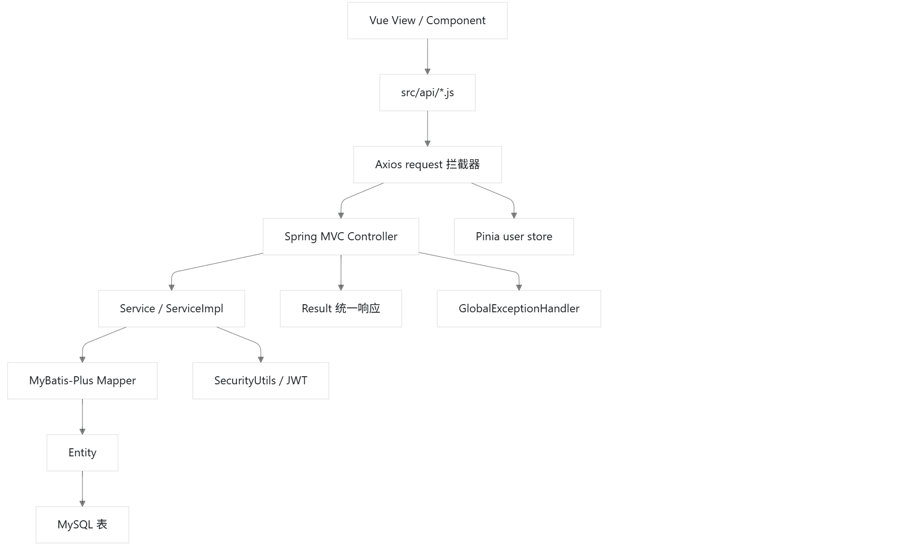
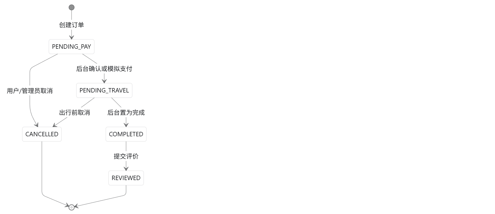

# 软件详细设计说明书

## 1 引言

本文档面向详细设计阶段，说明系统主要对象、接口、数据处理逻辑、异常处理、安全控制和测试追溯关系。

**所有业务场景的对象顺序图见 3**

系统采用前后端分离架构。前端技术栈为 Vue 3、Vite、Vue Router、Pinia、Element Plus 和 Axios；后端技术栈为 Spring Boot 3、Spring Security、MyBatis-Plus、MySQL 和 JWT。系统不接入真实支付或第三方实时业务 API，价格、库存、优惠券、景点和行程生成均使用站内演示数据或本地规则回退。

| 术语 | 含义 |
| --- | --- |
| 普通用户 | 使用前台查询、下单、评价、分享、行程等功能的旅客用户。 |
| 管理员 | 拥有后台权限，维护用户、商品、订单、内容和图片资源的用户。 |
| DTO | 请求参数对象，用于接收前端输入。 |
| VO | 响应展示对象，用于返回页面所需字段。 |
| 统一订单 | `orders` 主表保存公共字段，机票、火车票、酒店、旅游产品分别使用明细表保存差异字段。 |
| Result | 后端统一响应格式，承载成功标记、业务数据和错误信息。 |

## 2 总体详细设计

### 2.1 分层结构

系统按“页面组件 - API 封装 - Controller - Service - Mapper - Entity/Database”分层实现。前端页面不直接拼接后端地址，统一通过 `src/api/*.js` 调用接口；后端 Controller 只负责请求入口、鉴权上下文读取和响应包装，核心业务规则集中在 Service 层。

### 2.2 统一状态设计

订单状态由统一订单服务维护，所有业务类型共用主状态，业务差异通过明细表和库存回滚逻辑处理。

### 2.3 公共异常与安全设计

| 设计点 | 详细说明 |
| --- | --- |
| 认证 | 登录成功后签发 JWT，前端通过 Axios 拦截器携带 Token。 |
| 授权 | `/api/admin/**` 仅允许管理员访问，用户侧写操作从安全上下文读取当前用户。 |
| 越权控制 | 用户资料、联系人、订单、行程、价格提醒、分享等数据均校验 `userId` 归属。 |
| 异常响应 | 参数错误、业务错误、未登录、无权限和系统异常统一转换为 `Result` 错误响应。 |
| 数据一致性 | 下单、取消、评价等涉及多表修改的逻辑集中在 Service 层，使用事务保证一致性。 |
| 文件上传 | 图片上传限制文件类型和保存目录，数据库只保存可访问 URL 或相对路径。 |

## 3 业务场景详细设计

### 3.1 UC01 用户注册登录与退出

| 设计项 | 内容 |
| --- | --- |
| 需求编号 | REQ01 |
| 前端对象 | `LoginView.vue`、`AdminLoginView.vue`、`stores/user.js`、`api/auth.js`、`api/admin.js` |
| 后端对象 | `AuthController`、`AdminAuthController`、`AuthServiceImpl`、`AdminAuthServiceImpl`、`SecurityUserService` |
| 数据对象 | `User`、`Role`、`UserRole` |
| 数据表 | `user`、`role`、`user_role` |
| 主要接口 | `POST /api/auth/register`、`POST /api/auth/login`、`POST /api/auth/logout`、`POST /api/admin/auth/login` |
| 测试追溯 | `AuthServiceImplTest`、`AdminAuthServiceImplTest`、`AuthIntegrationTest`、`JwtTokenProviderTest` |

处理逻辑：注册时校验用户名、手机号和两次密码一致性，密码使用 BCrypt 加密后写入用户表，并绑定普通用户角色；登录时校验账号存在、状态可用和密码正确；退出时将令牌加入黑名单并清理前端登录状态。

异常分支：用户名重复、手机号重复、密码错误、账号禁用、Token 失效、管理员角色不足。

### 3.2 UC02 个人资料与常用联系人管理

| 设计项 | 内容 |
| --- | --- |
| 需求编号 | REQ02 |
| 前端对象 | `ProfileView.vue`、`api/user.js`、`api/userContact.js` |
| 后端对象 | `UserController`、`UserContactController`、`UserServiceImpl`、`UserContactServiceImpl` |
| 数据对象 | `User`、`UserContact` |
| 数据表 | `user`、`user_contact` |
| 主要接口 | `GET /api/users/me`、`PUT /api/users/me`、`/api/user-contacts` |
| 测试追溯 | `UserServiceImplTest`、`UserContactServiceImplTest`、`UserProfileIntegrationTest`、`UserContactIntegrationTest` |

处理逻辑：资料更新只允许修改昵称、手机号等允许字段；联系人增删改查全部按当前登录用户过滤；设置默认联系人时清除该用户其他默认标记。

异常分支：未登录、手机号格式错误、联系人不存在、操作他人联系人、默认联系人冲突。

### 3.3 UC03 机票查询、详情查看与下单

| 设计项 | 内容 |
| --- | --- |
| 需求编号 | REQ03 |
| 前端对象 | `FlightView.vue`、`FlightDetailView.vue`、`FlightBookingView.vue`、`api/flight.js`、`api/order.js` |
| 后端对象 | `FlightController`、`OrderController`、`FlightServiceImpl`、`OrderServiceImpl` |
| 数据对象 | `Flight`、`Orders`、`OrderFlight`、`Coupon` |
| 数据表 | `flight`、`orders`、`order_flight`、`coupon` |
| 主要接口 | `GET /api/public/flights`、`GET /api/public/flights/{id}`、`POST /api/orders/flights` |
| 测试追溯 | `FlightServiceImplTest`、`OrderServiceImplTest`、`OrderFlowIntegrationTest` |

处理逻辑：前台可匿名查询航班；下单必须登录。订单服务根据航班状态和剩余座位判断是否可售，按乘机人数扣减库存，统一生成订单号和订单主表记录。

异常分支：航班不存在、库存不足、出行人信息缺失、优惠券不可用、重复提交导致库存不足。

### 3.4 UC04 火车票查询、详情查看与下单

| 设计项 | 内容 |
| --- | --- |
| 需求编号 | REQ04 |
| 前端对象 | `TrainView.vue`、`TrainDetailView.vue`、`TrainBookingView.vue`、`api/train.js`、`api/order.js` |
| 后端对象 | `TrainController`、`OrderController`、`TrainServiceImpl`、`OrderServiceImpl` |
| 数据对象 | `TrainTicket`、`Orders`、`OrderTrain`、`Coupon` |
| 数据表 | `train_ticket`、`orders`、`order_train`、`coupon` |
| 主要接口 | `GET /api/public/trains`、`GET /api/public/trains/{id}`、`POST /api/orders/trains` |
| 测试追溯 | `TrainServiceImplTest`、`OrderServiceImplTest`、`OrderFlowIntegrationTest` |

处理逻辑：火车票下单按席别区分价格和库存；订单明细保存车次、席别、乘车人和出发到达信息；取消订单时按席别恢复库存。

异常分支：车次不存在、席别无效、席别库存不足、乘车人信息不完整。

### 3.5 UC05 酒店查询、详情查看与预订

| 设计项 | 内容 |
| --- | --- |
| 需求编号 | REQ05 |
| 前端对象 | `HotelView.vue`、`HotelDetailView.vue`、`HotelBookingView.vue`、`api/hotel.js`、`api/order.js` |
| 后端对象 | `HotelController`、`OrderController`、`HotelServiceImpl`、`OrderServiceImpl` |
| 数据对象 | `Hotel`、`HotelRoom`、`Orders`、`OrderHotel` |
| 数据表 | `hotel`、`hotel_room`、`orders`、`order_hotel` |
| 主要接口 | `GET /api/public/hotels`、`GET /api/public/hotels/{id}`、`POST /api/orders/hotels` |
| 测试追溯 | `HotelServiceImplTest`、`OrderServiceImplTest` |

处理逻辑：酒店详情返回酒店基础信息和房型列表；预订时校验入住日期早于离店日期，并根据入住晚数、房间数量和单价计算金额。

异常分支：酒店或房型不存在、日期非法、房型库存不足、房间数量非法。

### 3.6 UC06 旅游产品浏览、详情查看与下单

| 设计项 | 内容 |
| --- | --- |
| 需求编号 | REQ06 |
| 前端对象 | `TourView.vue`、`TourDetailView.vue`、`TourBookingView.vue`、`api/tour.js`、`api/order.js` |
| 后端对象 | `TourController`、`OrderController`、`TourServiceImpl`、`OrderServiceImpl` |
| 数据对象 | `TourPackage`、`Orders`、`OrderTour` |
| 数据表 | `tour_package`、`orders`、`order_tour` |
| 主要接口 | `GET /api/public/tours`、`GET /api/public/tours/{id}`、`POST /api/orders/tours` |
| 测试追溯 | `TourServiceImplTest`、`OrderServiceImplTest` |

处理逻辑：旅游产品下单按出行人数计算总价，保存出发日期、联系人、产品快照和订单状态；取消时恢复产品库存。

异常分支：产品下架、库存不足、出行日期不合法、联系人缺失。

### 3.7 UC07 订单查询、详情查看与取消

| 设计项 | 内容 |
| --- | --- |
| 需求编号 | REQ07 |
| 前端对象 | `OrderView.vue`、`OrderDetailView.vue`、`OrderDetailPanel.vue`、`api/order.js` |
| 后端对象 | `OrderController`、`OrderServiceImpl` |
| 数据对象 | `Orders`、`OrderFlight`、`OrderTrain`、`OrderHotel`、`OrderTour` |
| 数据表 | `orders` 和各类订单明细表 |
| 主要接口 | `GET /api/orders`、`GET /api/orders/{id}`、`POST /api/orders/{id}/cancel` |
| 测试追溯 | `OrderServiceImplTest`、`OrderFlowIntegrationTest` |

处理逻辑：订单列表按当前用户、类型和状态过滤；订单详情根据 `businessType` 加载不同明细；取消订单先校验归属和可取消状态，再按业务类型恢复库存。

异常分支：订单不存在、非本人订单、状态不可取消、库存恢复失败。

### 3.8 UC08 已完成订单评价

| 设计项 | 内容 |
| --- | --- |
| 需求编号 | REQ08 |
| 前端对象 | `OrderView.vue`、`OrderDetailView.vue`、`ReviewDialog.vue`、`api/review.js` |
| 后端对象 | `ReviewController`、`ReviewServiceImpl`、`OrderServiceImpl` |
| 数据对象 | `Review`、`Orders` |
| 数据表 | `review`、`orders` |
| 主要接口 | `GET /api/orders/reviewable`、`POST /api/reviews`、`GET /api/orders/{id}/review` |
| 测试追溯 | `ReviewServiceImplTest`、`ReviewShareAdminIntegrationTest` |

处理逻辑：评价只允许订单所有人在订单完成后提交一次；评分和内容需要通过参数校验；提交后订单在前端不再显示为可评价。

异常分支：订单未完成、已评价、非本人订单、评分超出范围、内容为空。

### 3.9 UC09 手动行程规划管理

| 设计项 | 内容 |
| --- | --- |
| 需求编号 | REQ09 |
| 前端对象 | `TripPlanView.vue`、`TripPlanDetailView.vue`、`api/tripPlan.js` |
| 后端对象 | `TripPlanController`、`TripPlanServiceImpl` |
| 数据对象 | `TripPlan`、`TripPlanItem` |
| 数据表 | `trip_plan`、`trip_plan_item` |
| 主要接口 | `GET/POST /api/trip-plans`、`GET/PUT/DELETE /api/trip-plans/{id}`、`/api/trip-plans/{id}/items` |
| 测试追溯 | 行程规划接口可通过集成测试或手工演示追溯 |

处理逻辑：行程主表保存标题、目的地、起止日期等信息；行程项保存第几天、时间、地点和说明；所有操作必须校验行程归属。

异常分支：行程不存在、非本人行程、日期范围非法、行程项天数超出范围。

### 3.10 UC10 AI 或本地规则生成行程并保存

| 设计项 | 内容 |
| --- | --- |
| 需求编号 | REQ10 |
| 前端对象 | `TripPlanView.vue`、`api/tripPlan.js` |
| 后端对象 | `TripPlanController`、`AiTripPlanServiceImpl`、`TripPlanServiceImpl` |
| 数据对象 | `Attraction`、`TripPlan`、`TripPlanItem` |
| 数据表 | `attraction`、`trip_plan`、`trip_plan_item` |
| 主要接口 | `POST /api/trip-plans/ai-preview`、`POST /api/trip-plans/ai-save` |
| 测试追溯 | AI 预览和保存流程可通过行程规划演示与服务测试补充追溯 |

处理逻辑：系统先从本地景点库按目的地筛选候选项，再尝试使用 AI 生成结构化行程；AI 不可用时用本地规则按天分配景点，保证演示流程稳定。

异常分支：目的地为空、天数非法、景点数据不足、AI 超时后回退、本地规则生成失败。

### 3.11 UC11 旅行分享发布与浏览

| 设计项 | 内容 |
| --- | --- |
| 需求编号 | REQ11 |
| 前端对象 | `ShareListView.vue`、`ShareCreateView.vue`、`ShareDetailView.vue`、`api/share.js` |
| 后端对象 | `ShareController`、`ShareServiceImpl`、`MediaUploadServiceImpl` |
| 数据对象 | `SharePost`、`ShareImage` |
| 数据表 | `share_post`、`share_image` |
| 主要接口 | `GET /api/public/shares`、`GET /api/public/shares/{id}`、`POST /api/shares/upload`、`POST /api/shares` |
| 测试追溯 | `ShareServiceImplTest`、`MediaUploadServiceImplTest`、`ReviewShareAdminIntegrationTest` |

处理逻辑：公开分享列表允许游客访问；发布分享必须登录；图片先上传得到 URL，再随正文提交保存；分享详情加载正文和多张图片。

异常分支：未登录发布、图片类型不支持、图片过大、正文为空、分享不存在。

### 3.12 UC12 价格对比与价格提醒

| 设计项 | 内容 |
| --- | --- |
| 需求编号 | REQ12 |
| 前端对象 | `PriceComparePanel.vue`、`PriceAlertDialog.vue`、`ProfileView.vue`、`api/price.js`、`api/priceAlert.js` |
| 后端对象 | `PriceCompareController`、`PriceAlertController`、`PriceCompareServiceImpl`、`PriceAlertServiceImpl` |
| 数据对象 | `Coupon`、`Flight`、`Hotel`、`TourPackage`、`PriceAlert` |
| 数据表 | `coupon`、`flight`、`hotel`、`tour_package`、`price_alert` |
| 主要接口 | `/api/public/price-compare/*`、`/api/price-alerts` |
| 测试追溯 | `PriceCompareServiceImplTest`、`PriceAlertServiceImplTest` |

处理逻辑：价格对比基于站内商品和优惠券模拟，不抓取外部实时价格；价格提醒按当前用户保存，可在个人中心查看和删除。

异常分支：商品类型非法、商品不存在、目标价非法、操作他人提醒。

### 3.13 UC13 管理员商品与图片管理

| 设计项 | 内容 |
| --- | --- |
| 需求编号 | REQ13 |
| 前端对象 | `FlightManageView.vue`、`TrainManageView.vue`、`HotelManageView.vue`、`HotelRoomManageView.vue`、`TourManageView.vue`、`AdminCrudPage.vue`、`api/admin.js` |
| 后端对象 | `AdminProductManageController`、`AdminMediaController`、`AdminProductManageServiceImpl`、`MediaUploadServiceImpl` |
| 数据对象 | `Flight`、`TrainTicket`、`Hotel`、`HotelRoom`、`TourPackage` |
| 数据表 | `flight`、`train_ticket`、`hotel`、`hotel_room`、`tour_package` |
| 主要接口 | `/api/admin/flights`、`/api/admin/trains`、`/api/admin/hotels`、`/api/admin/hotel-rooms`、`/api/admin/tours`、`POST /api/admin/media/upload` |
| 测试追溯 | `AdminProductManageServiceImplTest`、`MediaUploadServiceImplTest` |

处理逻辑：后台对不同商品类型使用统一 CRUD 页面模式，具体字段由各管理页面配置；图片上传先得到路径，再绑定到商品记录。

异常分支：非管理员访问、商品字段缺失、库存或价格非法、图片格式非法、商品被订单引用后删除受限。

### 3.14 UC14 管理员用户、订单、内容管理

| 设计项 | 内容 |
| --- | --- |
| 需求编号 | REQ14 |
| 前端对象 | `DashboardView.vue`、`UserManageView.vue`、`OrderManageView.vue`、`AdminOrderDetailView.vue`、`ShareManageView.vue`、`ReviewManageView.vue`、`api/admin.js` |
| 后端对象 | `AdminDashboardController`、`AdminUserManageController`、`AdminOrderManageController`、`AdminContentManageController` |
| 数据对象 | `User`、`Role`、`Orders`、`SharePost`、`Review` |
| 数据表 | `user`、`user_role`、`orders`、订单明细表、`share_post`、`review` |
| 主要接口 | `/api/admin/dashboard`、`/api/admin/users`、`/api/admin/orders`、`/api/admin/shares`、`/api/admin/reviews` |
| 测试追溯 | `AdminDashboardServiceImplTest`、`AdminUserManageServiceImplTest`、`AdminOrderManageServiceImplTest`、`AdminContentManageServiceImplTest` |

处理逻辑：后台管理功能均要求管理员角色；驾驶舱聚合统计平台数据；用户管理支持启停账号和角色维护；订单管理支持状态调整和后台取消；内容管理支持删除违规分享和评价。

异常分支：非管理员访问、用户不存在、禁止禁用自身账号、订单状态流转非法、内容不存在。

## 4 接口与数据设计

### 4.1 接口设计原则

| 原则 | 说明 |
| --- | --- |
| 统一前缀 | 前台业务接口使用 `/api`，公开查询使用 `/api/public`，后台接口使用 `/api/admin`。 |
| 统一响应 | Controller 返回 `Result<T>`，前端根据响应状态统一提示。 |
| 统一鉴权 | 登录态由 JWT 识别，管理员接口由 Spring Security 统一限制。 |
| 统一分页 | 列表接口通过查询参数传入页码、页大小、关键字和状态。 |
| 统一错误 | 参数校验和业务异常由全局异常处理器转换为可展示错误信息。 |

### 4.2 数据表分组

| 数据分组 | 表 |
| --- | --- |
| 用户权限 | `user`、`role`、`user_role`、`user_contact` |
| 产品资源 | `flight`、`train_ticket`、`hotel`、`hotel_room`、`tour_package`、`attraction` |
| 订单交易 | `orders`、`order_flight`、`order_train`、`order_hotel`、`order_tour`、`coupon` |
| 内容互动 | `share_post`、`share_image`、`review` |
| 价格辅助 | `price_alert` |

### 4.3 关键数据一致性规则

| 场景 | 一致性规则 |
| --- | --- |
| 下单 | 先校验商品存在和库存，再扣减库存，最后写入订单主表和明细表。 |
| 取消 | 先校验订单归属和状态，再更新订单状态，并按业务类型恢复库存。 |
| 评价 | 先校验订单完成、归属和未评价，再写入评价记录。 |
| 默认联系人 | 同一用户只能保留一个默认联系人。 |
| AI 行程保存 | 预览不落库，用户确认保存后才写入行程主表和行程项。 |
| 图片上传 | 文件保存成功后再将访问路径写入业务表。 |

## 5 测试与追溯设计

| 用例 | 需求 | 主要代码 | 测试或验证方式 |
| --- | --- | --- | --- |
| UC01 | REQ01 | 认证 Controller/Service、安全组件 | 单元测试、认证集成测试、登录演示 |
| UC02 | REQ02 | 用户资料、联系人模块 | 单元测试、用户资料和联系人集成测试 |
| UC03 | REQ03 | 航班查询、机票订单 | 服务测试、订单流集成测试、前端下单演示 |
| UC04 | REQ04 | 车次查询、火车票订单 | 服务测试、订单流集成测试、前端下单演示 |
| UC05 | REQ05 | 酒店查询、酒店订单 | 服务测试、前端预订演示 |
| UC06 | REQ06 | 旅游产品、旅游订单 | 服务测试、前端下单演示 |
| UC07 | REQ07 | 订单中心、取消订单 | 服务测试、订单流集成测试 |
| UC08 | REQ08 | 订单评价 | 服务测试、分享评价后台集成测试 |
| UC09 | REQ09 | 手动行程规划 | 前后端联调演示、建议补充服务测试 |
| UC10 | REQ10 | AI/规则行程生成 | 前后端联调演示、建议补充回退测试 |
| UC11 | REQ11 | 分享发布、图片上传 | 服务测试、分享评价后台集成测试 |
| UC12 | REQ12 | 价格对比、价格提醒 | 价格服务测试、价格提醒服务测试 |
| UC13 | REQ13 | 后台商品和图片管理 | 后台商品服务测试、上传服务测试 |
| UC14 | REQ14 | 后台用户、订单、内容管理 | 后台管理服务测试、后台集成演示 |

## 6 维护设计

| 维护点 | 说明 |
| --- | --- |
| 配置维护 | 数据库连接、JWT 密钥、上传目录和 AI 配置放在后端配置文件中。 |
| 数据维护 | 演示数据通过 SQL 初始化，管理员可在后台维护商品、用户、订单和内容。 |
| 日志维护 | 后端保留接口异常日志，便于定位业务校验和数据库错误。 |
| 文档维护 | 需求、概要、详细、测试和追溯文档统一使用 UC01-UC14 编号。 |
| 扩展维护 | 后续拆分微服务时，可按用户、商品、订单、内容、行程、后台管理边界迁移。 |

