# 需求说明书

## 1. 引言

### 1.1 目的

本文档用于说明“出行旅游平台”的需求范围、业务场景、参与者、概念模型、功能需求和非功能需求，重点保证每个确认后的业务场景都能追溯到设计、代码和测试。

**用户故事见 3**

**概念类图见 4**

**所有业务场景的系统顺序图见 5**

### 1.2 项目范围

本项目是一个综合旅游平台，采用前后端分离架构，覆盖普通用户端和管理员后台端。平台不接入真实支付，不依赖第三方实时票务、酒店或旅游产品接口，使用本地数据库和演示数据完成完整业务流程。

系统主要功能包括：

- 用户注册、登录、退出。
- 个人资料和常用联系人管理。
- 机票查询、详情查看、下单。
- 火车票查询、详情查看、下单。
- 酒店查询、详情查看、预订。
- 旅游产品浏览、详情查看、下单。
- 统一订单中心、订单详情、订单取消。
- 已完成订单评价。
- 手动行程规划。
- AI 或本地规则行程生成并保存。
- 旅行分享发布与浏览。
- 价格对比与价格提醒。
- 管理员商品与图片管理。
- 管理员用户、订单、内容管理。

### 1.3 技术背景

| 层次 | 技术 |
| --- | --- |
| 前端 | Vue 3、Vite、Vue Router、Pinia、Element Plus、Axios |
| 后端 | Spring Boot 3、Spring Security、MyBatis-Plus、JWT |
| 数据库 | MySQL 8 |
| 构建与测试 | Maven、npm、Vitest、JUnit |
| 后续部署 | Docker、CI/CD、Kubernetes |

### 1.4 角色定义

| 角色 | 说明 |
| --- | --- |
| 游客 | 未登录用户，可浏览公开内容和进入登录注册页面 |
| 普通用户 | 已登录用户，可使用下单、订单、评价、行程、分享、价格提醒等功能 |
| 管理员 | 拥有后台权限的用户，可管理商品、订单、用户、分享和评价 |
| 系统 | 执行认证、校验、库存扣减、订单状态流转、行程生成、健康检查等自动行为 |

## 2. 产品整体描述

### 2.1 产品定位

出行旅游平台目标是提供一套业务链路完整、模块结构清晰、可测试、可容器化、可改造为微服务的综合旅游系统。

### 2.2 产品功能概览

| 功能域 | 主要能力 |
| --- | --- |
| 用户与认证 | 注册、登录、退出、当前用户信息、管理员登录 |
| 个人中心 | 修改个人资料、维护常用联系人、查看价格提醒 |
| 产品浏览 | 航班、车次、酒店、房型、旅游产品查询和详情 |
| 订单交易 | 机票、火车票、酒店、旅游产品下单，订单查询、详情、取消 |
| 行程规划 | 手动创建行程、维护每日安排、AI 或本地规则生成行程 |
| 内容互动 | 发布旅行分享、上传图片、浏览分享、订单评价 |
| 价格服务 | 站内价格对比、目标价格提醒 |
| 后台管理 | 用户管理、商品管理、订单管理、分享和评价管理、数据概览 |

### 2.3 运行约束

- 系统用于课程演示，不接入真实支付。
- 不调用真实票务、酒店、旅游产品供应商接口。
- 第三方 AI 能力必须可关闭；未配置密钥或调用失败时应回退本地规则生成。
- 代码和文档不得包含真实密钥、Token 或云平台凭据。
- 所有业务接口统一返回后端 `Result` 格式。
- 前后端和数据库后续需要支持容器化启动。
- 微服务改造后，各业务服务不得跨服务直接访问其他服务数据表。

## 3. 用户故事与需求编号

| 需求编号 | 用户故事 |
| --- | --- |
| REQ01 | 作为普通用户，我想要注册、登录和退出平台，以便使用需要身份认证的旅游服务。 |
| REQ02 | 作为普通用户，我想要维护个人资料和常用联系人，以便下单时快速填写出行人信息。 |
| REQ03 | 作为普通用户，我想要查询航班、查看详情并创建机票订单，以便完成机票预订流程。 |
| REQ04 | 作为普通用户，我想要查询车次、查看详情并创建火车票订单，以便完成火车票预订流程。 |
| REQ05 | 作为普通用户，我想要查询酒店、选择房型并创建酒店订单，以便完成住宿预订流程。 |
| REQ06 | 作为普通用户，我想要浏览旅游产品、查看详情并下单，以便购买旅游度假产品。 |
| REQ07 | 作为普通用户，我想要查看订单列表、订单详情并取消订单，以便管理自己的订单。 |
| REQ08 | 作为普通用户，我想要对已完成订单进行评价，以便反馈消费体验。 |
| REQ09 | 作为普通用户，我想要创建行程计划并维护每日安排，以便管理个人旅行计划。 |
| REQ10 | 作为普通用户，我想要根据目的地、天数和偏好生成行程并保存，以便快速获得旅行规划建议。 |
| REQ11 | 作为普通用户，我想要发布旅行分享并浏览公开分享，以便交流旅行经验。 |
| REQ12 | 作为普通用户，我想要查看价格对比并设置价格提醒，以便发现更合适的购买时机。 |
| REQ13 | 作为管理员，我想要维护航班、车次、酒店、房型、旅游产品和图片，以便保证商品数据可用。 |
| REQ14 | 作为管理员，我想要管理用户、订单、分享和评价内容，以便维护平台正常运营。 |

## 4. 概念类图

## 5. 业务场景说明

### UC01 用户注册登录与退出

| 项目 | 内容 |
| --- | --- |
| 需求编号 | REQ01 |
| 参与者 | 游客、普通用户、管理员 |
| 触发条件 | 用户进入登录注册页面或后台登录页面 |
| 前置条件 | 用户未登录；注册时用户名和手机号未被占用 |
| 主成功流程 | 1. 用户输入注册或登录信息。2. 系统校验参数。3. 系统校验密码或创建账号。4. 系统签发 JWT。5. 前端保存 token 并加载用户信息。6. 用户点击退出后系统注销登录态。 |
| 异常流程 | 用户名重复、密码错误、账号禁用、token 失效时，系统返回错误提示并拒绝进入受保护页面。 |
| 可验证结果 | 登录成功后可进入个人中心或后台首页；退出后访问受保护页面会跳转登录页。 |

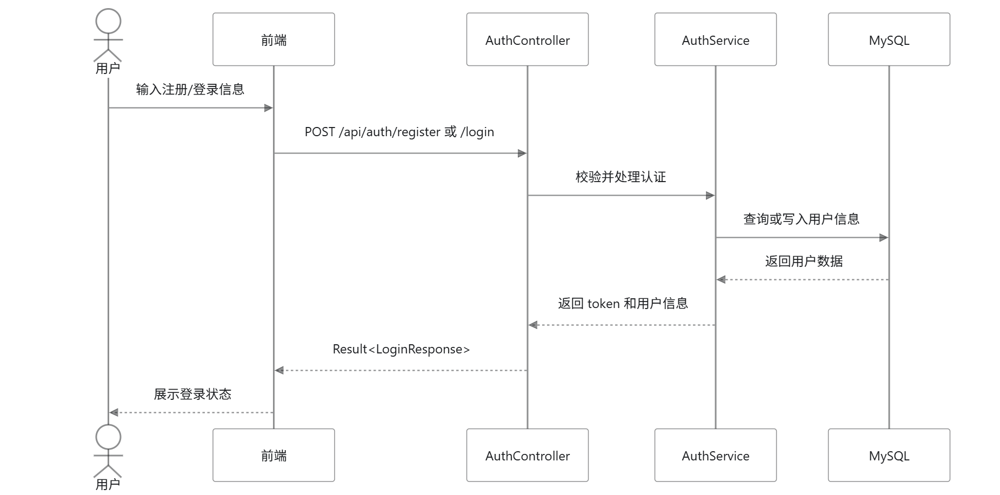

### UC02 个人资料与常用联系人管理

| 项目 | 内容 |
| --- | --- |
| 需求编号 | REQ02 |
| 参与者 | 普通用户 |
| 触发条件 | 用户进入个人中心 |
| 前置条件 | 用户已登录 |
| 主成功流程 | 1. 用户查看当前资料和联系人。2. 用户修改昵称、手机号或联系人信息。3. 系统校验字段格式和归属权限。4. 系统保存数据。5. 前端刷新最新信息。 |
| 异常流程 | 未登录、手机号格式错误、联系人不存在、修改他人联系人时，系统拒绝操作。 |
| 可验证结果 | 资料和联系人列表更新成功，下单页面可选择维护后的联系人。 |

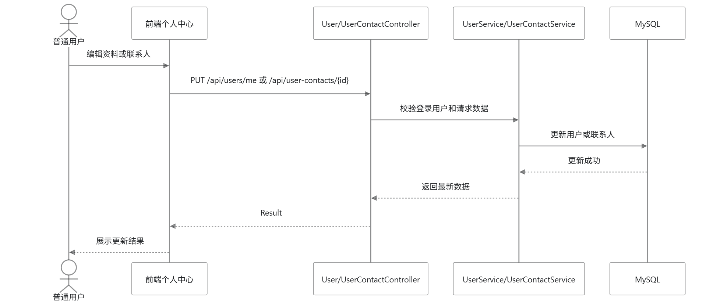

### UC03 机票查询、详情查看与下单

| 项目 | 内容 |
| --- | --- |
| 需求编号 | REQ03 |
| 参与者 | 普通用户 |
| 触发条件 | 用户从首页进入机票预订 |
| 前置条件 | 查询和详情可未登录；下单必须登录且航班有库存 |
| 主成功流程 | 1. 用户输入出发地、目的地等条件。2. 系统返回航班列表。3. 用户查看航班详情。4. 用户进入下单页填写乘机人。5. 系统校验库存、计算金额、扣减库存并创建订单。6. 前端展示订单详情。 |
| 异常流程 | 未登录时跳转登录；航班不存在、库存不足、乘机人信息不合法时，系统拒绝下单。 |
| 可验证结果 | 生成机票订单，订单中心可查询，航班库存减少。 |

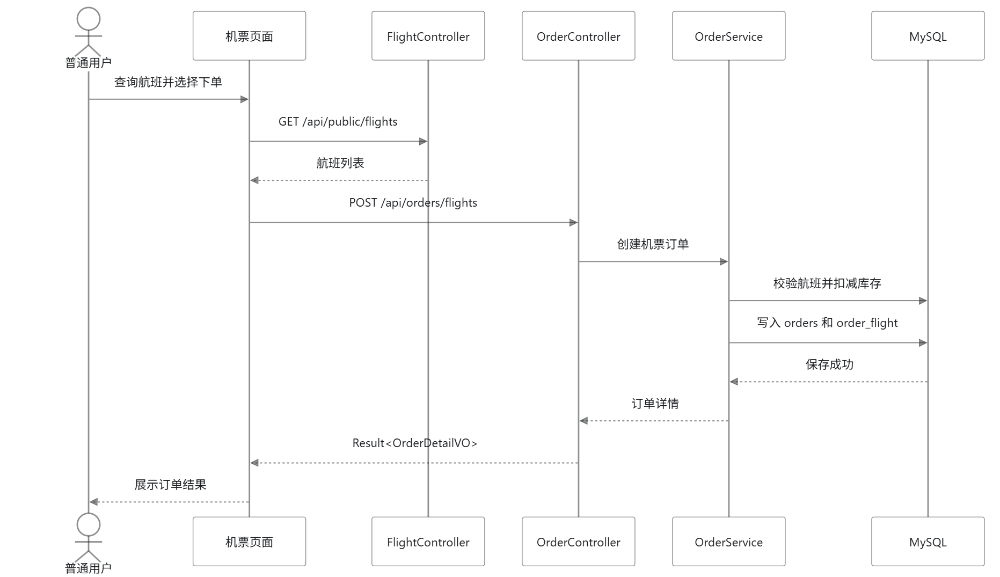

### UC04 火车票查询、详情查看与下单

| 项目 | 内容 |
| --- | --- |
| 需求编号 | REQ04 |
| 参与者 | 普通用户 |
| 触发条件 | 用户进入火车票模块 |
| 前置条件 | 下单时用户已登录，所选席别有库存 |
| 主成功流程 | 1. 用户查询车次。2. 系统返回车次列表。3. 用户查看车次详情和席别价格。4. 用户选择席别并填写乘车人。5. 系统扣减对应席别库存并创建订单。 |
| 异常流程 | 车次不存在、席别无库存、乘车人信息不合法、未登录时，下单失败。 |
| 可验证结果 | 生成火车票订单，对应席别库存减少，订单详情显示车次信息。 |

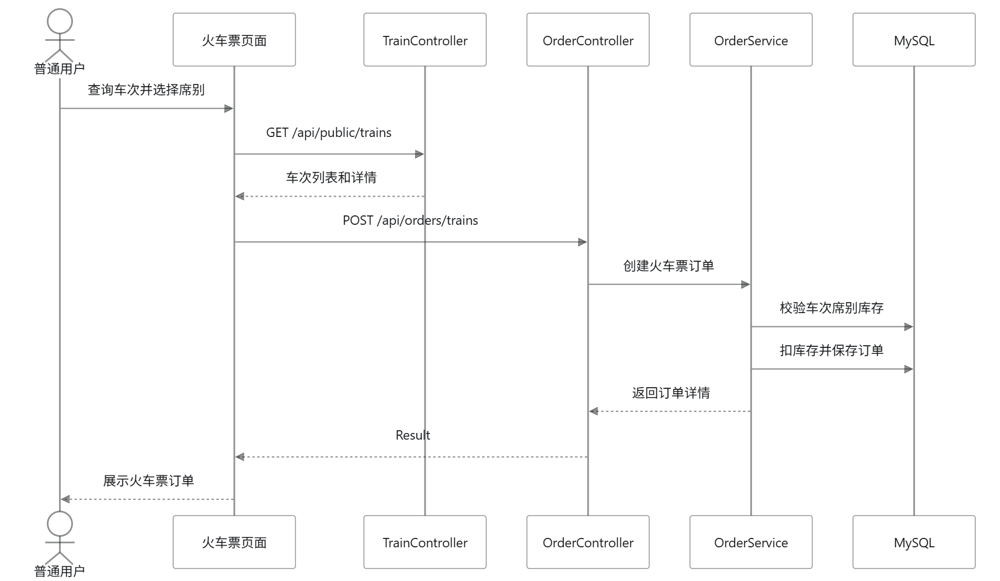

### UC05 酒店查询、详情查看与预订

| 项目 | 内容 |
| --- | --- |
| 需求编号 | REQ05 |
| 参与者 | 普通用户 |
| 触发条件 | 用户进入酒店住宿模块 |
| 前置条件 | 下单时用户已登录，房型库存充足 |
| 主成功流程 | 1. 用户按城市、日期等条件查询酒店。2. 系统返回酒店列表。3. 用户查看酒店详情和房型。4. 用户选择房型、入住日期和联系人。5. 系统校验房型库存并创建酒店订单。 |
| 异常流程 | 酒店或房型不存在、库存不足、入住日期非法、未登录时，系统拒绝预订。 |
| 可验证结果 | 生成酒店订单，房型库存减少，订单详情显示入住信息。 |

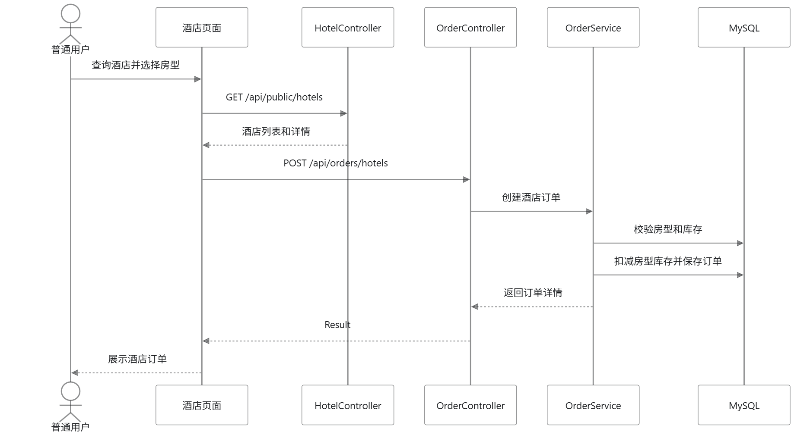

### UC06 旅游产品浏览、详情查看与下单

| 项目 | 内容 |
| --- | --- |
| 需求编号 | REQ06 |
| 参与者 | 普通用户 |
| 触发条件 | 用户进入旅游度假模块 |
| 前置条件 | 下单时用户已登录，旅游产品有库存 |
| 主成功流程 | 1. 用户浏览旅游产品列表。2. 系统返回产品信息。3. 用户查看详情。4. 用户填写出行信息并提交订单。5. 系统扣减库存并创建旅游产品订单。 |
| 异常流程 | 产品下架、库存不足、出行信息不合法、未登录时，下单失败。 |
| 可验证结果 | 订单中心出现旅游产品订单，产品库存减少。 |

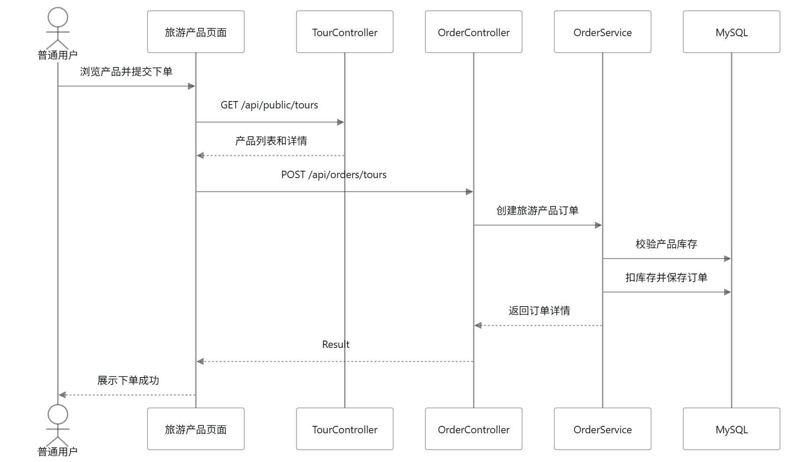

### UC07 订单查询、详情查看与取消

| 项目 | 内容 |
| --- | --- |
| 需求编号 | REQ07 |
| 参与者 | 普通用户 |
| 触发条件 | 用户进入我的订单 |
| 前置条件 | 用户已登录 |
| 主成功流程 | 1. 用户查看订单列表。2. 系统按用户、业务类型和状态返回订单。3. 用户进入订单详情。4. 用户对允许取消的订单发起取消。5. 系统修改订单状态并恢复库存。 |
| 异常流程 | 未登录、访问他人订单、订单不存在、订单已完成或已取消时，系统拒绝操作。 |
| 可验证结果 | 订单状态变为已取消，相关库存恢复。 |

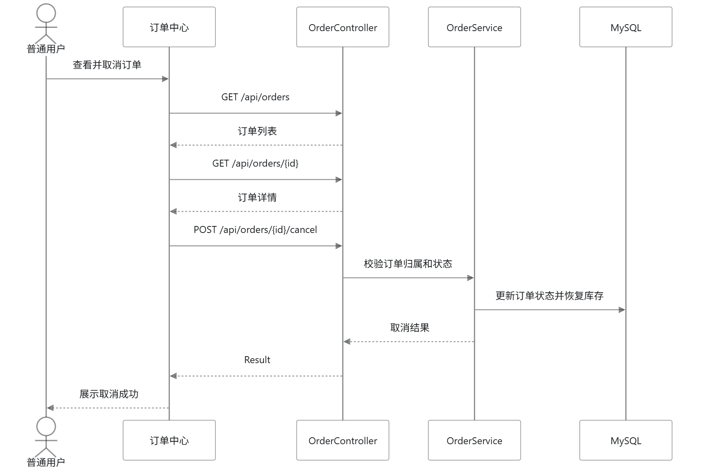

### UC08 已完成订单评价

| 项目 | 内容 |
| --- | --- |
| 需求编号 | REQ08 |
| 参与者 | 普通用户 |
| 触发条件 | 用户在订单中心点击评价 |
| 前置条件 | 用户已登录，订单属于当前用户且状态为已完成 |
| 主成功流程 | 1. 用户查看可评价订单。2. 用户填写评分和评价内容。3. 系统校验订单状态和是否已评价。4. 系统保存评价。5. 前端展示评价结果。 |
| 异常流程 | 未登录、订单未完成、重复评价、评价内容非法时，系统拒绝提交。 |
| 可验证结果 | 评价保存成功，订单评价详情可查询。 |

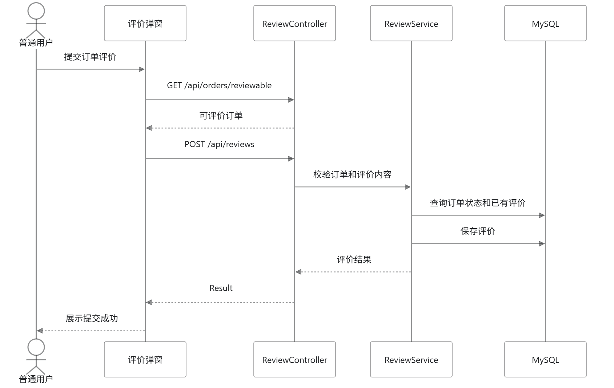

### UC09 手动行程规划管理

| 项目 | 内容 |
| --- | --- |
| 需求编号 | REQ09 |
| 参与者 | 普通用户 |
| 触发条件 | 用户进入行程规划 |
| 前置条件 | 用户已登录 |
| 主成功流程 | 1. 用户创建行程计划。2. 系统保存行程基本信息。3. 用户进入详情页添加每日安排。4. 用户修改或删除行程项。5. 系统保存最新行程。 |
| 异常流程 | 未登录、行程不存在、访问他人行程、日期或标题非法时，系统拒绝操作。 |
| 可验证结果 | 行程列表和详情展示用户维护后的行程安排。 |

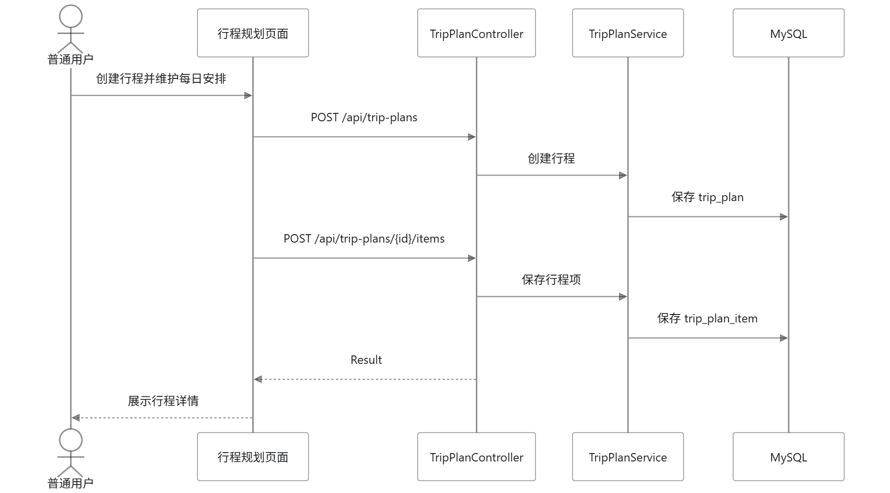

### UC10 AI 或本地规则生成行程并保存

| 项目 | 内容 |
| --- | --- |
| 需求编号 | REQ10 |
| 参与者 | 普通用户、系统 |
| 触发条件 | 用户点击 AI 生成行程 |
| 前置条件 | 用户已登录；系统存在景点基础数据 |
| 主成功流程 | 1. 用户输入目的地、天数、出发日期和偏好。2. 系统查询候选景点。3. 系统调用 AI 或本地规则生成按天行程。4. 用户预览结果。5. 用户保存为正式行程。 |
| 异常流程 | AI 未配置或调用失败时，系统使用本地规则生成；目的地无景点或输入非法时返回提示。 |
| 可验证结果 | 用户得到行程预览，保存后行程列表出现对应计划和每日安排。 |

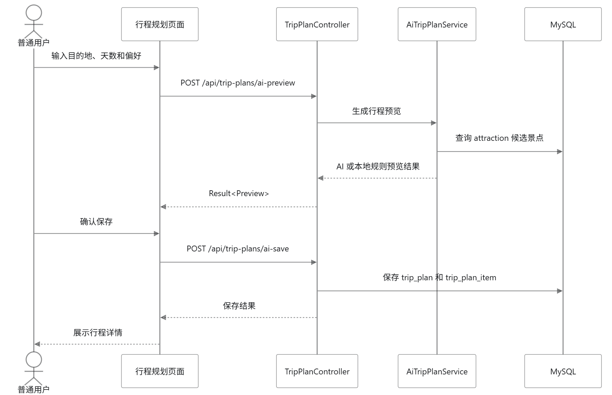

### UC11 旅行分享发布与浏览

| 项目 | 内容 |
| --- | --- |
| 需求编号 | REQ11 |
| 参与者 | 游客、普通用户 |
| 触发条件 | 用户进入旅行分享模块 |
| 前置条件 | 浏览公开分享无需登录；发布分享需要登录 |
| 主成功流程 | 1. 游客或用户浏览分享列表。2. 用户登录后进入发布页。3. 用户填写标题、正文并上传图片。4. 系统保存分享和图片。5. 分享在公开列表展示。 |
| 异常流程 | 未登录发布、图片上传失败、标题或正文为空、访问不存在分享时，系统提示错误。 |
| 可验证结果 | 分享发布成功，公开列表和详情页可查看。 |

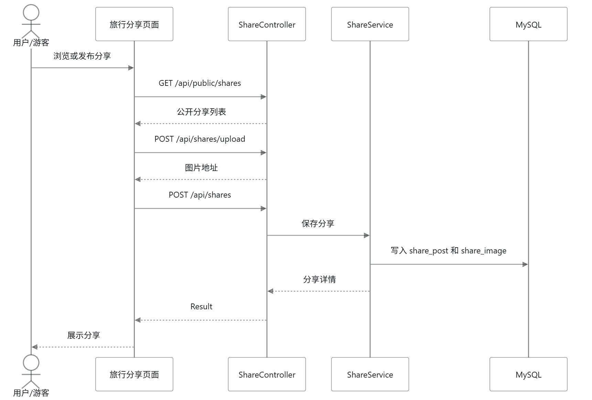

### UC12 价格对比与价格提醒

| 项目 | 内容 |
| --- | --- |
| 需求编号 | REQ12 |
| 参与者 | 普通用户 |
| 触发条件 | 用户在商品详情或个人中心查看价格信息 |
| 前置条件 | 查看价格对比可不登录；创建价格提醒需要登录 |
| 主成功流程 | 1. 用户查看商品价格对比。2. 系统返回当前价、优惠和模拟渠道价格。3. 用户设置目标价格提醒。4. 系统保存提醒。5. 用户在个人中心查看或删除提醒。 |
| 异常流程 | 商品不存在、目标价格非法、未登录创建提醒时，系统拒绝操作。 |
| 可验证结果 | 价格对比数据展示正确；价格提醒可新增、查看、删除。 |

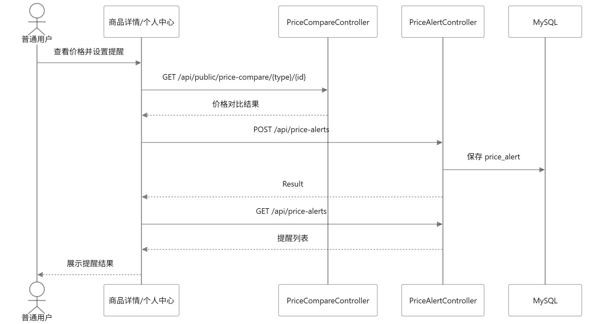

### UC13 管理员商品与图片管理

| 项目 | 内容 |
| --- | --- |
| 需求编号 | REQ13 |
| 参与者 | 管理员 |
| 触发条件 | 管理员进入后台商品管理 |
| 前置条件 | 管理员已登录并拥有后台权限 |
| 主成功流程 | 1. 管理员选择航班、车次、酒店、房型或旅游产品管理。2. 系统展示对应列表。3. 管理员新增、修改或删除商品。4. 管理员上传封面图或详情图。5. 系统保存商品和图片信息。 |
| 异常流程 | 未登录、非管理员、必填字段缺失、价格或库存非法、删除有关联订单的商品时，系统拒绝操作。 |
| 可验证结果 | 商品数据变更成功，前台列表和详情页展示最新数据和图片。 |

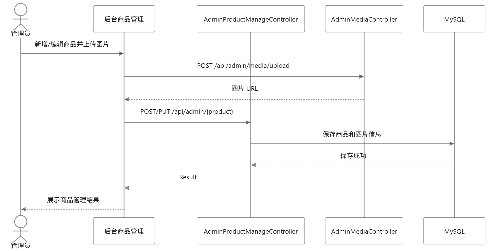

### UC14 管理员用户、订单、内容管理

| 项目 | 内容 |
| --- | --- |
| 需求编号 | REQ14 |
| 参与者 | 管理员 |
| 触发条件 | 管理员进入后台首页、用户管理、订单管理或内容管理 |
| 前置条件 | 管理员已登录并拥有后台权限 |
| 主成功流程 | 1. 管理员查看后台统计。2. 管理员查询用户并修改状态或角色。3. 管理员查看订单详情并修改订单状态或取消订单。4. 管理员查看分享和评价并删除违规内容。 |
| 异常流程 | 未登录、非管理员、目标用户或订单不存在、状态流转非法时，系统拒绝操作。 |
| 可验证结果 | 后台统计正确；用户、订单、分享、评价的管理操作生效。 |

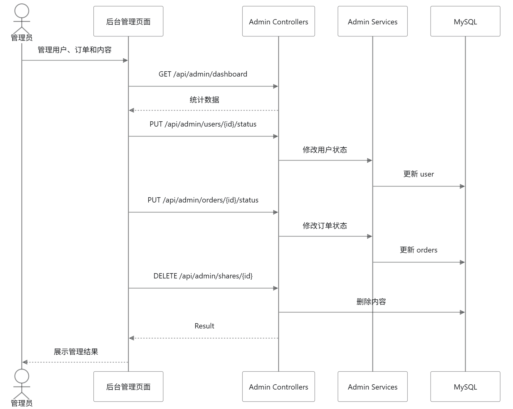

## 6. 非功能需求

### 6.1 性能需求

| 编号 | 需求 |
| --- | --- |
| NFR01 | 常规列表查询在本地演示环境下应在 3 秒内返回结果。 |
| NFR02 | 创建订单、取消订单、保存行程等核心写操作应在 5 秒内返回结果。 |
| NFR03 | 后续性能对比实验需选择 2-3 个主要接口，单体和微服务版本使用相同机器、相同数据和相同压测脚本，各运行至少 3 次。 |

### 6.2 安全需求

| 编号 | 需求 |
| --- | --- |
| NFR04 | 登录后接口必须校验 JWT。 |
| NFR05 | 管理员接口必须校验管理员角色。 |
| NFR06 | 普通用户不能访问、修改或取消他人订单、联系人、行程、价格提醒。 |
| NFR07 | 仓库中不得提交真实密码、Token、数据库口令或云平台密钥。 |

### 6.3 可用性需求

| 编号 | 需求 |
| --- | --- |
| NFR08 | 表单字段校验失败时应给出明确提示。 |
| NFR09 | AI 行程生成失败时应回退到本地规则生成，保证演示稳定。 |
| NFR10 | 后续 Kubernetes 部署中应提供健康检查和就绪检查。 |

### 6.4 可维护性需求

| 编号 | 需求 |
| --- | --- |
| NFR11 | 后端保持 controller、service、mapper、entity、dto、vo 分层清晰。 |
| NFR12 | 前端保持 api、views、components、stores、router 分层清晰。 |
| NFR13 | 微服务改造后，每张业务表必须有明确服务归属。 |
| NFR14 | 跨服务数据访问必须通过接口完成，不允许直接跨服务联表查询。 |

